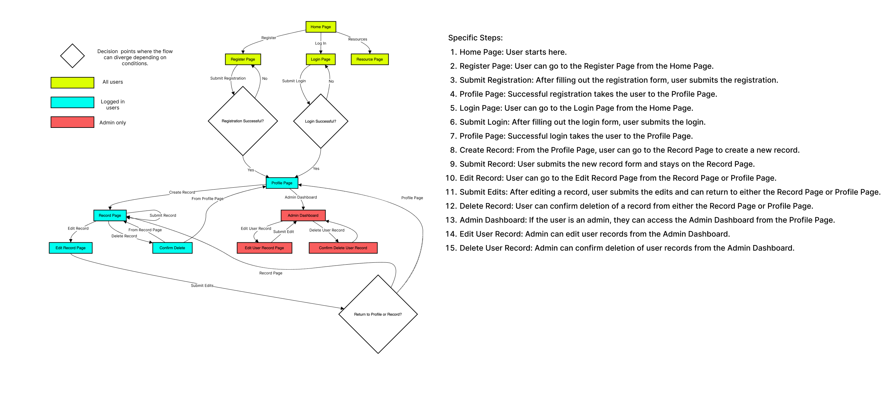

# LiDARFind
## Overview
**LiDARFind** is a web application designed for enthusiasts and professionals to explore and discover archaeological sites using LiDAR data. The platform allows users to view, interact with, and edit LiDAR data on an interactive map interface.  The live website can be found here.

## Introduction
LiDARFind is a web application dedicated to documenting and sharing archaeological discoveries made through LiDAR data analysis. Our platform provides a collaborative space for users to contribute their findings, engage with the community, and contribute to the preservation and understanding of the historic environment through citizen science.

Whether you're an archaeology enthusiast, a hobbyist, or a professional researcher, LiDARFind offers a user-friendly interface to explore and document archaeological sites discovered using LiDAR technology. our database aims to showcase the rich heritage of Wales hidden beneath the surface.

## User Experience UX
### Strategy
#### Project Rationale
The LiDARFind project was conceived to address the need for a more engaging platform that encourages the exploration and redocumentation of archaeological sites using the extensive LiDAR coverage available for Wales. While there are several websites that allow users to view LiDAR data, they typically offer limited engagement beyond passive exploration. LiDARFind addresses this gap by  empowering users to actively record their own archaeological sites in a database, facilitating their personal research and contributing to collective knowledge.

LiDAR data is an invaluable resource for archaeologists, providing detailed insights into the historic environment of Wales. By leveraging this open-source resource, LiDARFind enables anyone to access and engage with the data, fostering a community of citizen scientists dedicated to uncovering and preserving our shared heritage. Through this platform, users can collaboratively document findings, enhance their understanding of the past, and contribute to the preservation of archaeological sites across Wales.

LiDARFind has significant real-world applications, including:
- **Enhanced Archaeological Research:** Accelerating the identification and study of archaeological sites, contributing to academic research and historical knowledge.
- **Conservation Efforts:** Informing conservation strategies by mapping and documenting sites at risk due to climate change and other environmental factors.
- **Public Engagement:** Encouraging public participation in archaeology, fostering a deeper connection to cultural heritage and history.
- **Policy and Planning:** Assisting in land management and planning decisions by providing detailed records of archaeological assets.

### Target Audience
LiDARFind is designed with inclusivity in mind, catering to both newcomers and seasoned experts. Whether you are an archaeology enthusiast just starting out or a professional researcher with years of experience, LiDARFiind offers intuitive features that make it accessible and valuable to all users.

### Website Owners Goals
1. To provide a platform for users to document and share archaeological discoveries made through LiDAR data analysis.
2. To facilitate collaboration and community engagement in archaeological research.
3. To contribute to the preservation and understanding of the historic environment through citizen science.

### External User Goals
1. **Discover New Sites:** Users want to explore LiDAR data to identify potential archaeological sites that have not been documented before.
2. **Document Findings:** Users aim to record their discoveries, adding detailed descriptions to create a comprehensive record.
3. **Learn and Educate:** Users seek to learn more about archaeology through LiDARFind and educate others by sharing their knowledge and discoveries.
4. **Contribute to Research:** Users want to participate in archaeological research by contributing their documented findings to the database, aiding both amateur and professional research efforts.
5. **Track Personal Discoveries:** Users want to keep a personal log of the sites they have discovered and documented, allowing them to track their contributions over time.

### User Stories
1. **As a user:**
1.1: I want to quickly grasp the essence of LiDARFind and understand how it caters to me. 
1.2: I want to navigate the website effortlessly, ensuring a positive and enjoyable experience and find relevant information.
1.3: I want the website to be accessible on any device and have a responsive design.
2. **As a visitor without an account:**
2.1: I want to understand the purpose of the website immediately upon arrival.
2.2: I want to browse and explore documented archaeological discoveries made through LiDAR data analysis.
2.3: I want to browse and search for documented archaeological discoveries based on various criteria.
2.4: I want to be able to register for an account to contribute my own discoveries.
3. **As a registered user:**
3.1: I want to be able to log in to my account securely.
3.2: I want to be able to submit my own archaeological discoveries to the database.
3.3: I want to be able to edit or delete the discoveries I have submitted.
3.4: I want to easily log out of my account when needed.
4. **As an administrator of the site:**
4.1: I want to manage the database of archaeological discoveries, including adding, editing, or deleting entries.

## Scope
### Features:
#### General:
  - Responsive Design
  - Database to store records
  - Navigation

#### All Users
- Interactive map for exploring records
- Filter records based on search criteria
- Toggle between various map layers (satellite imagery, openStreetMap and LiDAR)
- Registration form
- Login form

#### Registered Users
- Ability to create, edit and delete own records
- A profile page displaying own records

#### Administrators
- Ability to edit and delete records of any user
- An admin dashboard to display a lsit of all users and their records

## Structure
### Site Structure
This section outlines a typical user experience through the website, from landing on the homepage to logging out.

**Landing on the Homepage:**
- User visits the homepage of the website.
- They see an overview of what the website offers (e.g., discovering archaeological sites through LiDAR).

**Registration:**
- If the user is new, they click on the "Register" button.
- They are taken to the registration page where they fill in their username, password, confirm password, and skill level.
- After completing the form, they submit it to create an account.
- If the registration is successful, they are redirected to their profile page with a flash message confirming successful registration.

**Login:**
- Returning users click on the "Login" button.
- They are taken to the login page where they enter their username and password.
- Upon successful login, they are redirected to their profile page with a flash message confirming successful login.

**Exploring the Profile Page:**
- On the profile page, users can view their details and records.
The profile page might displays any user-specific records they have created, listed with details like title, period, site type, etc.

**Creating a New Record:**
- Users can click on the "Create a Record" button.
- This takes them to a form where they can fill out details about a new site record (title, PRN, site type, monument type, interpretation, period, location).
- The location is selected by clicking on a map, which autofills the coordinates.
- Once the form is completed, they submit it to save the record.
- The new record is then displayed in their profile and on the map.

**Interacting with Records on the Map:**
- Users can explore records on an interactive map.
- Clicking on markers on the map shows popups with details about the records.
- They can edit or delete records using options provided in the popups or profile page.

**Editing a Record:**
- Users can select a record to edit from their profile or map.
- They are taken to a form similar to the create record form, pre-filled with the record's existing details.
- They can make changes and submit the form to update the record.

**Deleting a Record:**
- Users can select a record to delete from their profile or map.
- A confirmation modal appears asking if they are sure they want to delete the record.
- If confirmed, the record is deleted from the database.

**Logging Out:**
- Users can click the "Logout" button to end their session.
- They are redirected to a logout confirmation page.
- From here, they can choose to log back in or return to the homepage.

The user flow diamgram below illustrates the typical path a user may take through LiDARFind:




### Database Structure
#### Collections
**1. Users**
  - Stores information about the users of the system.
  - Fields:
    - `_id`: Unique identifier for each user.
    - `username`: The name of the user.
    - `password`: The hashed password of the user.
    - `skill_level`: The skill level of the user (e.g., "novice explorer").
    - `password`: The hashed password of the user.
    - `member_since`: The date the user registered.
    - `is_admin`: if true the user has admin rights (set to default on regitration and requires manually editing). 

{<br>
  "_id": "6661ab47a1676de37943eaf5",<br>
  "username": "charlie",<br>
  "password": "scrypt:32768:8:1$4P1FLzuOMPUrpdlV$c5a84187baf5a545f2ad1a51aba9d41f916e…",<br>
  "skill_level": "novice explorer",<br>
  "member_since": 024-07-09T17:46:42.245+00:00,<br>
  "is_admin": "True"<br>
}

**3. Site_types**
  - Stores different types of information along with related monument types.
  - Fields:
    - `_id`: Unique identifier for each site type.
    - `site_type`: The type of the site (e.g. "Bank").
    - `monument_types`: An array of objects representing related monument types.
  
{<br>
  "_id": "6662cc170b191595ccd03bf8",<br>
  "site_type": "Bank",<br>
  "monument_types": [<br>
    { "monument_type": "Curvilinear" },<br>
    { "monument_type": "Linear" }<br>
  ]<br>
}

**3. Periods**
  - Stores information about the different historical periods.
  - Fields:
    - `_id`: Unique identifier for each period.
    - `period_name`: The name of the period (e.g. "Prehistoric").

{<br>
  "_id": "665d8f160462f486c49228dd",<br>
  "period_name": "Prehistoric"<br>
}

**3. Records**
  - Stores records of archaeologicaL sites.
  - Fields:
    - `_id`: Unique identifier for each record.
    - `title`: The title of each record.
    - `prn`: A unique identifier for the site if available.
    - `site_type`: The type of the site (e.g., "Mound").
    - `monument_type`: The type of monument found at the site (e.g. "Motte").
    - `description`: Description or interpretation of the site.
    - `period`: The historical period of the site (e.g. "Medieval").
    - `location`: The geographic coordinates of the site.
    - `created_on`: Timestamp of when the record was created.
    - `created_by`: Username of the user who created the record.

{<br>
  "_id": "6662d7eb2eec3c460959a099",<br>
  "title": "Penlle'r Castell",<br>
  "prn": "",<br>
  "site_type": "Mound",<br>
  "monument_type": "Motte",<br>
  "interpretation": "Medieval Castle near Swansea",<br>
  "period": "Medieval",<br>
  "location": "51.76914868643818, -3.9355631592453166",<br>
  "created_on": "07/06/2024, 10:39:44",<br>
  "created_by": "charlie"<br>
}

#### Relationships
**User to Records:**
Each user (in Users collection) can create multiple records (in Records collection).  
The `created_by` field in the Records collection references the `username` in the Users collection.

**Records to Site_types:**
Each record in the Records collection references a `site_type` from the Site_types collection.  
The `site_type` field in the Records collection matches the `site_type` in the Site_types collection.

**Records to Periods:**
Each record in the Records collection references a `period` from the Periods collection.  
The `period` field in the Records collection matches the `period_name` in the Periods collection.

**Site_types to Monument_types:** 
Each site type in the Site_types collection contains multiple related monument types.  
The `monument_types` array within the Site_types collection holds this nested relationship.

#### Example Use Case

**Registration**

A new user registers and their details are stored in the Users collection.

**Create Record**

The user creates a new record by selecting a site type and monument type from the Site_types collection and a period from the Periods collection.  
The record is then stored in the Records collection with references to the selected `site_type` and `period`.

**View Records**

The user can view records they created by fetching documents from the Records collection where the `created_by` field matches their username.

#### Why MongoDB
MongoDB, a non-relational database, was chosen for this project because of its flexibility and scalability. Unlike traditional relational databases, MondoFB allows for a flexible schema design, which is particularly beneficial for handling varied and evolving data structures like archaeological records. 
  - Flexible Schema: MongoDB allows for a flexible schema design, meaning new fields can be added to documents without affecting existing ones. This is useful for dealing with diverse and evolving data types.
  - Document-Based Model: MongoDB's document-based model allows related data to be stored together in a single document, which simplifies data retrieval and improves performance. For example, site types and their associated monument types are stored together.
  - Scalability: MongoDB can handle large volumes of data and supports horizontal scaling, which is beneficial as the project grows and more records are added.
  - Performance: MongoDB allows for efficient data retrieval and manipulation, ensuring a responsive user experience when dealing with large datasets.


**Entity-Relationship Diagram (ERD)**
To illustrate the structure and relationships of the collections in the MongoDB database, an Entity-Relationship Diagram (ERD) has been created. The ERD visually represents the relationships between users, site types, periods, and records, making it easier to understand how the data is interconnected.


## Skeleton Plane
Prior to commencing the website coding process, comprehensive wireframes were produced for each page using Figma - a design tool used for creating user interfaces, prototypes, and wireframes. These wireframes served as the initial blueprints, providing a visual roadmap for the website's layout and structure on both desktop and mobile devices.

It's important to note that while the final web pages evolved from these early plans, some deviations were intentionally made to enhance the user experience and align better with the project's goals. The website design relied heavily on using Leaflet frames, and much of the development involved adapting and optimizing these frames to meet the site's objectives. This required significant modifications and iterations as the project progressed.

This iterative process allowed for flexibility in adapting to evolving project requirements, ultimately contributing to the development of a more refined and user-friendly website.

<details>
  <summary>Home (Desktop)</summary>
  
</details>

## Design
### Colour Scheme
For the LiDARFind project, the chosen colour scheme embraces a minimalistic approach, ensuring that the primary focus remains on the maps and the data they present. The design aims to be sleek and sophisticated, mirroring the advanced technology of LiDAR. Key elements, such as call-out buttons, are designed to stand out without overwhelming the user.

**Primary Colours**
   - **Background Colour: #e1eaec**
      - The main background colour is a light, muted blue-grey (#e1eaec). This colour provides a modern and professional aesthetic, creating a clean and unobtrusive backdrop for the content.
**Accent Colours**
  - **Navbar and Footer Colour: #263238** 
    - The navbar and footer are highlighted in a dark blue-grey (#263238). This colour helps these sections stand out, providing a clear structure to the layout and emphasising important navigation and information areas.
  - **Primary Button Colour: #4CAF50**
    - The primary buttons, such as "Create Record," are highlighted in a vibrant green (#4CAF50). This colour is selected for its visibility against the background, ensuring that call-to-action elements are easily identifiable.
  - **Primary Button Hover Colour: #45a049**
    - On hover, the button colour shifts to a slightly darker green (#45a049), providing a clear visual feedback to the user and enhancing the interactive experience.

To ensure a consistent colour palette, the primary colour (#263238) was input into [UI Colors](https://uicolors.app/create). This tool generated complementary colours that were used consistently throughout the website, enhancing the overall visual appeal and user experience.


This colour scheme supports a professional and clean interface, where the focus is on usability and clarity. By keeping the design elements understated, users can concentrate on the primary functions and content of the website, such as exploring maps and creating records, without unnecessary distractions.

### Fonts
In the LidarFind project, typography is essential for achieving a modern and sophisticated look while ensuring readability across all content. The primary font used throughout the website is 'Inter', sourced from Google Fonts.

Inter, designed by Rasmus Andersson, a Swedish designer and software developer, is gaining popularity in the digital world. Created specifically for computer interfaces, Inter excels in making small text legible. Its open apertures, tall x-height, and unique letterforms enhance readability in digital contexts, especially in UI design where space is limited. The design considerations for digital legibility make Inter a valuable typeface for modern web projects (Source: https://uxplanet.org/the-only-8-fonts-you-will-ever-need-eb4e4088cb16).

For headings, 'Inter' adds a touch of professionalism and clarity, making important information stand out. The same font is applied to paragraph text to maintain a unified and consistent visual identity across the interface.

To ensure the text remains legible and visually appealing, a Sans Serif font serves as the fallback option. This guarantees that even if 'Inter' fails to load, the text will still be clear and easy to read.

By consistently using 'Inter' across the website, the design achieves a seamless and polished look, enhancing the user experience and ensuring that all information is easily accessible.

### Accessibility
Accessibility is a fundamental aspect of the LidarFind project, ensuring that all users, regardless of ability, can fully interact with the content.

**Colour Contrast:** The colour palette is designed with high contrast in mind, improving readability and ensuring that text and other content stand out against the background. This thoughtful approach provides a visually accessible experience for everyone.

**Font Selection:** Emphasising simplicity and readability, the fonts chosen are clear and easy to read. This choice ensures that the content remains legible for users with different visual abilities, fostering an inclusive user experience.

# FEATURES

# BUGS
## Fixed Bugs

### Conflict Between Materialize and Leaflet Layer Controls

**Issue:** When integrating the Materialize CSS framework and Leaflet for interactive maps into the application, radio buttons for toggling base layers in the Leaflet layer control were not visible. This made it impossible for users to switch between different base map layers.

**Solution:** The root cause was identified as a CSS conflict between Materialize and Leaflet frameworks, where Materialize's default styles were interfering with Leaflet controls. Using Dev Inspector Tools, the class selector for the layer controls was identified. Custom CSS was then implemented to properly display radio buttons. Materialize CSS sets the opacity of radio buttons to "0", so this was changed to "1" to ensure the Leaflet layer controls displayed correctly.


**Outcome:** After applying these CSS rules, the radio buttons for base layers and checkboxes for overlay layers in the Leaflet layer control were displayed correctly and were fully functional. This solution ensured that users could interact with the map layers as intended, providing a consistent and intuitive user experience.

### MongoDB '_id' Field Cannot be Directly Used in JSON

**Issue:** When retrieving data from a MongoDB database and attempting to return it as a JSON response, an error occurred due to the presence of the _id field. The _id field in MongoDB is an ObjectId type, which cannot be directly represented in JSON.

**Solution:** To resolve the issue, the '_id' field needs to be either excluded from the retrieved data or converted to a string representation before returning it as a JSON response.

**Outcome:** By excluding the _id field the application can successfully return the retrieved data as a JSON response without encountering errors related to the ObjectId type used by MongoDB for the _id field.

### Data Fetching Issue with MongoDB Cursor

**Issue** When fetching data from MongoDB and using it multiple times within the same template, the data did not render correctly. This issue arose because the data was retrieved as a cursor, which can only be iterated over once. After the first use, the cursor was exhausted, making the data unavailable for subsequent uses within the template. This problem particularly impacted the rendering of dropdown options on the record page, where the same data was needed for both the "Create Record" form and the search filters. As a result, the data was only available for the first use, and subsequent attempts to access it resulted in no data being rendered.

**Solution** Convert the cursor to a list immediately after fetching the data. This ensures that the data is fully retrieved and can be used multiple times within the template.


**Outcome** The data can now be used in more than one dropdown, resolving the issue and ensuring consistent data rendering across the template.

### Prefilling Input Texts

**Issue** When dynamically entering adding coordinate data to the record form the placeholder labels were overlapping the prefilled text. 

**Solution** Call the function M.updateTextFields(); to reinitialize all the Materialize the labels on the page (source: Materailize).


**Outcome** When the input field is auto-populated with the coordinates the placeholder text moves in to the active state and no longer overlaps the input. 

### Navbar Pushed Page Content Down on Smaller Screens

**Issue** When the navbar is expanded on smaller screens, it pushes the page content down instead of overlaying it. This causes the layout to shift unexpectedly, affecting the user experience.

**Solution** To resolve the issue, the CSS for the navbar was updated to use position: absolute, ensuring the navbar overlays the page content instead of pushing it down. Additionally, padding was added to the body to prevent content from being hidden behind the navbar. The following CSS was added:


**Outcome**  By applying the position: absolute property to the navbar and adding padding-top to the body, the navbar now overlays the page content when expanded on smaller screens. This prevents the content from being pushed down and ensures it is not hidden behind the navbar, maintaining a consistent layout and improving the overall user experience.

### Referrer Parameter Not Carried Over in Form Submission

**Issue:** When editing a record, the referrer parameter (`ref`) was not being carried over during the form submission, causing the application to redirect to the wrong page after saving or canceling the edit. The `ref` parameter, included in the query string, was not available in the POST request.

**Solution:** To resolve this issue, the `ref` parameter needs to be included as a hidden input field within the form. This ensures that the `ref` value is part of the form data sent during the POST request. The `edit_record` route was updated to retrieve the `ref` value from the form data instead of the query string.

**Outcome:** By adding the `ref` parameter as a hidden input field in the form and retrieving it from the form data in the `edit_record` route, the application can correctly determine the referrer and redirect users to the appropriate page (profile or add_record) after editing a record. This ensures that users are redirected back to the page they originated from, improving the user experience.

### Location Field Editable After Validation Causes Map Rendering Issues

**Issue:** When creating a new record, the location field is required as it is essential for creating a marker. However, after the form is validated, users were able to edit the location field, including removing it completely, and then submit the form. This causes the record to lack a marker due to missing location information, and subsequent records, even with valid locations, did not display on the map. Deleting the record with the missing location information from the database restored the map rendering for subsequent records.

**Solution:** To resolve the issue, JavaScript was used to make the location field 'read-only' after the location information had been entered. This prevents users from removing the location after form validation.

**Outcome:** By making the location field read-only after entry, users can no longer remove essential location information post-validation, ensuring that all records display their markers correctly on the map and maintaining the integrity of the map rendering process.


# TECHNOLOGY USED
### Languages
- HTML
- CSS
- JavaScript
- Python

### Frameworks
- Flask
- Materialize (initially used, later switched to Bootstrap)
- Bootstrap

### Libraries
- jQuery
- Font Awesome
- Google Fonts
- Jinja
- JS Hint

### Programs
- Figma
- Chrome Dev Tools
- Gitpod
- Heroku

### Tools/Services
- Elevanlabs
- Squoosh
- Responsinator
- W3C
- GitHub Pages
- Wistia


### Databases
- MongoDB

# TESTING
Please see [TESTING.md](TESTING.md).

# DEPLOYMENT
### MongoDB Non-Relational Database
This project uses [MongoDB](https://www.mongodb.com/) for the non-relational database. 

To obtain your own MongoDB Database URI, sign-up on their site, then follow these steps:

1. Name the database should be **lidar_find**
2. The collections needed for this database should are **"users", "periods", "site_type", "monument_type" and "records" .
3. Click on the database name name created for the project (LiDARFind).
4. Click on the Connect button.
5. Click Connect Your Application.
6. Copy the connection string, and replace password with your own password (also remove the angle-brackets).

### Deploying on Heroku
This project uses Heroku, a platform as a service (PaaS) that allows developers to build, deploy, and manage applications entirely in the cloud. Using a PaaS removes the need for building and maintaining the infrastructure typically associated with developing and launcing an app. 

Once an account has been registered the following deployment steps can be followed:

1. In the top-right corner of your Heroku Dashboard, click "New" and choose "Create new app" from the dropdown menu.
2. Enter a unique name for your app, select the region closest to your location (EU or USA), and then click "Create App".
3. Navigate to the Settings tab of your newly created app, click on "Reveal Config Vars," and configure your environment variables accordingly.

| Key          | Value            |
|--------------|------------------|
| DATABASE_URL | user's own value |
| IP           | 0.0.0.0          |
| MONGO_DBNAME | user's own value |
| MONGO_URI    | user's own value |
| PORT         | 5000             |
| SECRET_KEY   | user's own value |

To deploy your project on Heroku, you need to include two essential files:

  - requirements.txt
  - Procfile

To install the project's dependencies (if applicable), run the following command:
`pip3 install -r requirements.txt`

If you've installed additional packages, update the requirements file with:
`pip3 freeze --local > requirements.txt`

Create the Procfile with this command:
`echo web: python app.py > Procfile`

Replace app.py with the name of your main Flask application file located at the root level.

Note: Ensure the Procfile starts with an uppercase 'P' and has no file extension.

For connecting your GitHub repository to your Heroku app, follow these steps:

**Option 1:** Use Automatic Deployment from the Heroku app dashboard.

**Option 2:**

In your terminal or command-line interface (CLI), log in to Heroku:
`heroku login -i`

Set Heroku as a remote repository:
`heroku git:remote -a app_name`
Replace app_name with your actual app name.

After staging and committing your changes to GitHub, push your code to Heroku:
`git push heroku main`

Your project should now be connected and deployed on Heroku.

### Local Deployment
You can either clone or fork this project to create a local copy on your system.

After doing so, you need to install the necessary packages listed in the requirements.txt file by running:
`pip3 install -r requirements.txt`

Create a new file named env.py at the root level of your project. Include the environment variables mentioned in the Heroku deployment steps.

```
import os

os.environ.setdefault("IP", "0.0.0.0")
os.environ.setdefault("Port", "5000")
os.environ.setdefault("SECRET_KEY", "user's own value")
os.environ.setdefault("MONGO_URI", "user's own value")
os.environ.setdefault("MONGO_DB", "lidar_find")
```

### How to Fork
Forking a GitHub repository creates a copy of the original repository in your GitHub account, allowing you to view and make changes without affecting the original project. Follow these steps to fork the repository:

1. Log in to GitHub and find the repository you want to fork.
2. At the top of the repository page, just above the "Settings" button, click on the "Fork" button.
3. After clicking, you will have a copy of the repository in your own GitHub account.

### How to Clone
Cloning a repository allows you to create a local copy on your computer. Here’s how to do it:

1. Navigate to the GitHub repository you want to clone.
2. Click on the "Code" button above the list of files.
3. Choose whether you want to clone using HTTPS, SSH, or GitHub CLI, and click the copy button to copy the URL.
4. Open your Git shell or terminal.
5. Navigate to the directory where you want to store the cloned repository.
6. In your terminal, type the following command to clone the repository:
`git clone https://github.com/Melody-Lisa/blissboost.git`
7. Press Enter to create your local clone.


# RESOURCES
### Resources

| Topic                                              | Description                                                                                     | Source                                                                                                           | Accessed          |
|----------------------------------------------------|-------------------------------------------------------------------------------------------------|------------------------------------------------------------------------------------------------------------------|-------------------|
| Overriding Materialize CSS for Checkboxes          | Materialize CSS Radio buttons not visible                                                       | [Stack Overflow](https://stackoverflow.com/questions/49757521/materialize-css-radio-buttons-not-visible)         | 8th June, 2024    |
| Prefilling Input Texts                             | Text Inputs                                                                                     | [Materialize](https://pixinvent.com/materialize-material-design-admin-template/documentation/text-inputs.html)    | 24th June, 2024   |
| Using Leaflet Map Framework                        | Leaflet: an open-source JavaScript library for mobile-friendly interactive maps                 | [Leaflet](https://leafletjs.com/)                                                                                | 8th June, 2024    |
| Retrieving Coordinates from Map                    | How to remove all layers and features from map                                                  | [Stack Overflow](https://stackoverflow.com/questions/28646317/how-to-remove-all-layers-and-features-from-map)     | 9th June, 2024    |
| Map Functions                                      | Simple Click Events                                                                             | [Google Maps](https://developers.google.com/maps/documentation/javascript/examples/event-simple)                  | 9th June, 2024    |
| Hover Popups on Map                                | Showing popup on mouse-over, not on click using Leaflet                                         | [Stack Overflow](https://gis.stackexchange.com/questions/31951/showing-popup-on-mouse-over-not-on-click-using-leaflet) | 10th June, 2024   |
| Reset Map View                                     | Leaflet.ResetView                                                                               | [GitHub](https://github.com/drustack/Leaflet.ResetView)                                                          | 10th June, 2024   |
| For fetch requests and displaying data on a map                                  | SagaCity                                                                                        | [GitHub](https://github.com/isntlee/Sagacity/blob/master/templates/home.html)                                    | 9th June, 2024    |
| Adding Bing Satellite Imagery to Map               | Mapping API's: Leaflet - Adding Microsoft Bing Basemap Layers                                   | [Iowa State University Extension and Outreach](https://store.extension.iastate.edu/product/Mapping-APIs-Leaflet-Adding-Microsoft-Bing-Basemap-Layers) | 8th June, 2024    |
| Leaflet Custom Icons for Markers                   | Markers With Custom Icons                                                                       | [Leaflet](https://leafletjs.com/examples/custom-icons/)                                                          | 8th June, 2024    |
| Script for bing.js                                 | leaflet-plugins                                                                                  | [GitHub](https://github.com/shramov/leaflet-plugins)                                                             | 8th June, 2024    |
| Adding Event Listener to Dropdown Menus            | addEventListener, "change" and option selection                                                 | [Stack Overflow](https://stackoverflow.com/questions/24875414/addeventlistener-change-and-option-selection)      | 8th June, 2024    |
| Populating Dropdowns Dynamically                   | Dynamically Populate Second Dropdownlist from a First Dropdownlist using jQuery Ajax            | [YouTube](https://www.youtube.com/watch?v=xgwsAHeZaX0)                                                            | 8th June, 2024    |
| Displaying AJAX GET Request Data                   | How to display AJAX GET request data to HTML?                                                   | [Stack Overflow](https://stackoverflow.com/questions/62048242/how-to-display-ajax-get-request-data-to-html)      | 5th June, 2024    |
| W3 Schools Sidenav                                 | Open the Sidebar Navigation Over a Part of the Content                                          | [W3 Schools](https://www.w3schools.com/w3css/tryit.asp?filename=tryw3css_sidebar_over)                          | 19th June, 2024   |
| Manually Triggering Bootstrap Modal Using JS       | Bootstrap v5 Manually Call a Modal                                                              | [Stack Overflow](https://stackoverflow.com/questions/62827002/bootstrap-v5-manually-call-a-modal-mymodal-show-not-working-vanilla-javascrip) | 2nd July, 2024    |
| Looping Through User's Records in Accordion        | Using Jinja2 (Flask) to Loop Through a Bootstrap Accordion                                      | [Stack Overflow](https://stackoverflow.com/questions/45884780/using-jinja2-flask-to-loop-through-a-bootstrap-accordian) | 6th July, 2024    |
| Formatting Dates                                   | Formatting Time as %d-%m-%y                                                                     | [Stack Overflow](https://stackoverflow.com/questions/17245612/formatting-time-as-d-m-y)                          | 5th July, 2024    |
| Redirecting to External 404 Page in Flask          | How to Redirect to an External 404 Page in Python Flask                                         | [Stack Overflow](https://stackoverflow.com/questions/29516093/how-to-redirect-to-a-external-404-page-python-flask) | 8th July, 2024    |
| Redirecting User Based on Input                    | How do I Redirect Using Flask with an If Function Depending on User Input?                      | [Stack Overflow](https://stackoverflow.com/questions/65097431/how-do-i-redirect-using-flask-with-an-if-function-depending-on-the-input-of-the) | 8th July, 2024    |
| Window History Back                                | Window history.back()                                                                           | [W3 Schools](https://www.w3schools.com/jsref/met_his_back.asp)                                                   | 8th July, 2024    |
| Understanding Date Format                          | Format datetime.utcnow() Time                                                                   | [Stack Overflow](https://stackoverflow.com/questions/25406565/format-datetime-utcnow-time)                       | 8th July, 2024    |
| Passing Variables from Flask to JavaScript         | Passing Variables from Flask to JavaScript                                                      | [Stack Overflow](https://stackoverflow.com/questions/37259740/passing-variables-from-flask-to-javascript)         | 9th July, 2024    |
| Music for Intro Video                              | UPPBEAT                                                                                        | [UPPBEAT](https://uppbeat.io/browse/artist/qube) found at [UPPBEAT Music Inspiring](https://uppbeat.io/browse/music/inspiring) | 9th July, 2024    |
| Sticking Footer to Bottom of Page                  | The EASIEST Way To Push That Footer Down With CSS                                               | [YouTube](https://www.youtube.com/watch?v=AVPR_WuDw8o&list=PLx6XTedFrvFICl8XTWKE6mDst8FPo5ZRn&index=3)           | 16th July, 2024   |
| Making Leaflet Layers Toggle Control Always Open   | Making Leaflet Control Open by Default                                                          | [Stack Overflow](https://gis.stackexchange.com/questions/64385/making-leaflet-control-open-by-default)            | 18th July, 2024   |
| Creating User Flow Diagrams                        | Creating Flowcharts To Enhance Workflows With AI                                                  | [OpenReplay Blog](https://blog.openreplay.com/creating-flowcharts-to-enhance-workflows/?ref=dailydev)            | 19th July, 2024   |
| Passing variables from HTML to JS                        | Passing variables from HTML to JS                                                | [Reddit](https://www.reddit.com/r/flask/comments/yc00z3/passing_variables_from_html_to_js/)            | 23rd July, 2024   |
| Lazy Loading                        | Lazy Loading Images using Intersection Observer API                                                | [OpenReplay](https://blog.openreplay.com/lazy-loading-in-javascript/)            | 24th July, 2024   |


