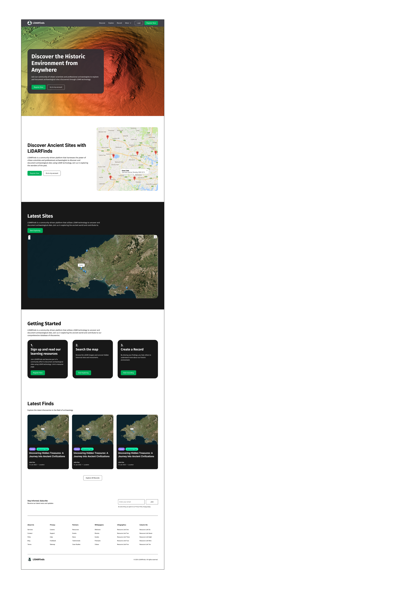
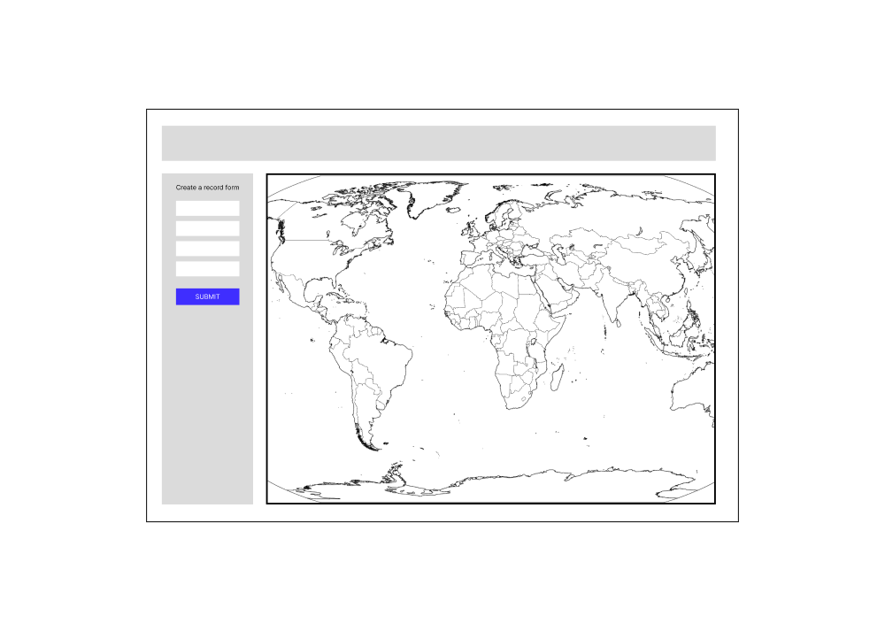
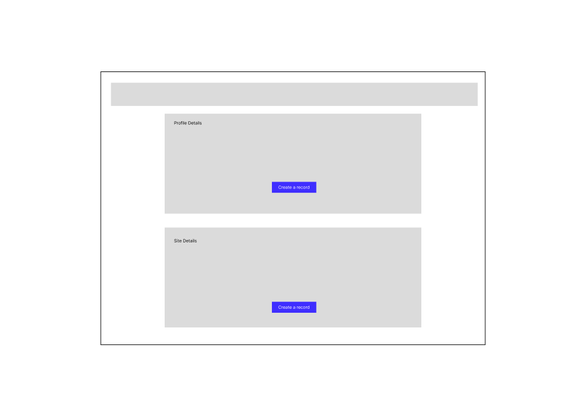

# LiDARFind
## Overview
**LiDARFind** is a web application designed for enthusiasts and professionals to explore and discover archaeological sites in Wales using LiDAR data. The platform allows users to view, interact with, and edit LiDAR data on an interactive map interface.  You can explore the live website here: [LiDARFind: The Welsh LiDAR Portal](https://lidarfind-a137ffb9e451.herokuapp.com/)


# Contents

1. [LiDARFind](#lidarfind)
2. [Overview](#overview)
3. [Introduction](#introduction)
4. [User Experience (UX)](#user-experience-ux)
    - [Strategy](#strategy)
      - [Project Rationale](#project-rationale)
      - [Target Audience](#target-audience)
      - [Website Owners Goals](#website-owners-goals)
      - [External User Goals](#external-user-goals)
      - [User Stories](#user-stories)
5. [Scope](#scope)
    - [Features](#features)
        - [General](#general)
        - [All Users](#all-users)
        - [Registered Users](#registered-users)
        - [Administrators](#administrators)
6. [Structure](#structure)
    - [Site Structure](#site-structure)
    - [Database Structure](#database-structure)
        - [Collections](#collections)
        - [Relationships](#relationships)
        - [Example Use Case](#example-use-case)
        - [Why MongoDB](#why-mongodb)
        - [Entity-Relationship Diagram (ERD)](#entity-relationship-diagram-erd)
7. [Skeleton Plane](#skeleton-plane)
8. [Design](#design)
    - [Colour Scheme](#colour-scheme)
    - [Fonts](#fonts)
    - [Accessibility](#accessibility)
9. [Features](#features)
10. [Future Enhancements](#future-enhancements)
11. [Technology Used](#technology-used)
12. [Testing](#testing)
13. [Deployment](#deployment)
    - [MongoDB Non-Relational Database](#mongodb-non-relational-database)
    - [Deploying on Heroku](#deploying-on-heroku)
    - [Local Deployment](#local-deployment)
    - [How to Fork](#how-to-fork)
    - [How to Clone](#how-to-clone)
14. [Resources](#resources)


## Introduction
LiDARFind is a web application designed to document and share archaeological discoveries using LiDAR data analysis in Wales. Our platform offers a collaborative space where users can share their findings, engage with the community, and help preserve and understand the historic environment through citizen science.

Whether you're an archaeology enthusiast, a hobbyist, or a professional researcher, LiDARFind offers a user-friendly interface to explore and document archaeological sites discovered using LiDAR technology. our database aims to showcase the rich heritage of Wales, providing detailed insights into its historic landscape.

**Unique Features of LiDARFind:**

- Interactive Mapping: Users can view and interact with archaeological sites on an interactive map.
- Personalised Profiles: Users can save and manage their discoveries, accessing them at any time.
- Community Engagement: The platform encourages collaboration and knowledge sharing among users.
!
**Why LiDARFind?**

Exclusive Coverage: While other UK websites offer platforms for recording archaeological discoveries, none focus exclusively on Wales despite its extensive LiDAR coverage.
Active Participation: Unlike platforms that offer only passive exploration, LiDARFind empowers users to actively record and contribute to a growing database of archaeological sites.

## User Experience UX
### Strategy
This section outlines the fundamental reasons behind the creation of LiDARFind and how it aims to address specific needs within the archaeological community. It delves into the rationale for the project, identifying the gaps and opportunities within existing platforms. This section also highlights the target audience, their goals, and the broader objectives of the website. By understanding these strategic elements, users can better appreciate the purpose and intended impact of LiDARFind.

### Project Rationale
While various UK websites offer platforms for recording archaeological discoveries, none focus exclusively on Wales, despite its comprehensive LiDAR coverage.

The LiDARFind project was conceived to address the need for a more engaging platform that encourages the exploration and documentation of archaeological sites using the extensive LiDAR coverage available for Wales. While several websites allow users to view LiDAR data, they typically offer limited engagement beyond passive exploration. LiDARFind addresses this gap by empowering users to actively record their own archaeological sites in a database, facilitating their personal research and contributing to collective knowledge.

Additionally, these other websites do not offer the facility for users to record and save their discoveries to their own profiles, where they can access and manage them whenever they want. LiDARFind provides this capability, allowing users to have a personalised experience and a repository of their findings.

LiDAR data is an invaluable resource for archaeologists, providing detailed insights into the historic environment of Wales. By leveraging this open-source resource, LiDARFind enables anyone to access and engage with the data, fostering a community of citizen scientists dedicated to uncovering and preserving our shared heritage. Through this platform, users can collaboratively document findings, enhance their understanding of the past, and contribute to the preservation of archaeological sites across Wales.


LiDARFind has significant real-world applications, including:
- **Enhanced Archaeological Research:** Accelerating the identification and study of archaeological sites, contributing to academic research and historical knowledge.
- **Conservation Efforts:** Informing conservation strategies by mapping and documenting sites at risk due to climate change and other environmental factors.
- **Public Engagement:** Encouraging public participation in archaeology, fostering a deeper connection to cultural heritage and history.
- **Policy and Planning:** Assisting in land management and planning decisions by providing detailed records of archaeological assets.

### Target Audience
LiDARFind is designed with inclusivity in mind, catering to both newcomers and seasoned experts. Whether you are an archaeology enthusiast just starting out or a professional researcher with years of experience, LiDARFind offers intuitive features that make it accessible and valuable to all users.

### Website Owners Goals
1. To provide a platform for users to document and share archaeological discoveries made through LiDAR data analysis.
2. To facilitate collaboration and community engagement in archaeological research.
3. To contribute to the preservation and understanding of the historic environment through citizen science.

### External User Goals
1. **Discover New Sites:** Users want to explore LiDAR data to identify potential archaeological sites that have not been documented before.
2. **Document Findings:** Users aim to record their discoveries, adding detailed descriptions to create a comprehensive record.
3. **Learn and Educate:** Users seek to learn more about archaeology through LiDARFind and educate others by sharing their knowledge and discoveries.
4. **Contribute to Research:** Users want to participate in archaeological research by contributing their documented findings to the database, aiding both amateur and professional research efforts.
5. **Track Personal Discoveries:** Users want to keep a personal log of the sites they have discovered and documented, allowing them to track their contributions over time.

### User Stories
1. **As a user:**<br>
1.1: I want to quickly grasp the essence of LiDARFind and understand how it caters to me.<br>
1.2: I want to navigate the website effortlessly, ensuring a positive and enjoyable experience and find relevant information.<br>
1.3: I want the website to be accessible on any device and have a responsive design.<br>
2. **As a visitor without an account:**<br>
2.1: I want to understand the purpose of the website immediately upon arrival.<br>
2.2: I want to browse and explore documented archaeological discoveries made through LiDAR data analysis.<br>
2.3: I want to browse and search for documented archaeological discoveries based on various criteria.<br>
2.4: I want to be able to register for an account to contribute my own discoveries.<br>
3. **As a registered user:**<br>
3.1: I want to be able to log in to my account securely.<br>
3.2: I want to be able to submit my own archaeological discoveries to the database.<br>
3.3: I want to be able to edit or delete the discoveries I have submitted.<br>
3.4: I want to easily log out of my account when needed.<br>
4. **As an administrator of the site:**<br>
4.1: I want to manage the database of archaeological discoveries, including adding, editing, or deleting entries.<br>

[Return to Top](#contents)


## Scope
To Ensure LiDARFind is able to meet the needs of its audience a variety of features designed to enhance user experience, engagement and functionality have been considered. At a minimum the following features have been deemed essential to meet the needs of different types of users and ensure the website is comprehensive and user friendly. 
### Features:
#### General:
  - Responsive Design
  - Database to store records
  - Navigation

#### All Users
- Interactive map for exploring records
- Filter records based on search criteria
- Toggle between various map layers (satellite imagery, openStreetMap and LiDAR)
- Registration form
- Login form

#### Registered Users
- Ability to create, edit and delete own records
- A profile page displaying own records

#### Administrators
- Ability to edit and delete records of any user
- An admin dashboard to display a lsit of all users and their records

[Return to Top](#contents)

## Structure
### Site Structure
This section outlines a typical user experience through the website, from landing on the homepage to logging out.

**Landing on the Homepage:**
- User visits the homepage of the website.
- They see an overview of what the website offers (e.g., discovering archaeological sites through LiDAR).

**Registration:**
- If the user is new, they click on the "Register" button.
- They are taken to the registration page where they fill in their username, password, confirm password, and skill level.
- After completing the form, they submit it to create an account.
- If the registration is successful, they are redirected to their profile page with a flash message confirming successful registration.

**Login:**
- Returning users click on the "Login" button.
- They are taken to the login page where they enter their username and password.
- Upon successful login, they are redirected to their profile page with a flash message confirming successful login.

**Exploring the Profile Page:**
- On the profile page, users can view their details and records.
- The profile page displays any user-specific records they have created, listed with details like title, period, site type, etc.

**Creating a New Record:**
- Users can click on the "Create a Record" button.
- This takes them to a form where they can fill out details about a new site record (title, PRN, site type, monument type, interpretation, period, location).
- The location is selected by clicking on a map, which autofills the coordinates.
- Once the form is completed, they submit it to save the record.
- The new record is then displayed in their profile and on the map.

**Interacting with Records on the Map:**
- Users can explore records on an interactive map.
- Clicking on markers on the map shows popups with details about the records.
- They can edit or delete records using options provided in the popups or profile page.

**Editing a Record:**
- Users can select a record to edit from their profile or map.
- They are taken to a form similar to the create record form, pre-filled with the record's existing details.
- They can make changes and submit the form to update the record.

**Deleting a Record:**
- Users can select a record to delete from their profile or map.
- A confirmation modal appears asking if they are sure they want to delete the record.
- If confirmed, the record is deleted from the database.

**Logging Out:**
- Users can click the "Logout" button to end their session.
- They are redirected to a logout confirmation page.
- From here, they can choose to log back in or return to the homepage.

The user flow diamgram below illustrates the typical path a user may take through LiDARFind:


### Database Structure
#### Collections
**1. Users**
  - Stores information about the users of the system.
  - Fields:
    - `_id`: Unique identifier for each user.
    - `username`: The name of the user.
    - `password`: The hashed password of the user.
    - `skill_level`: The skill level of the user (e.g., "novice explorer").
    - `password`: The hashed password of the user.
    - `member_since`: The date the user registered.
    - `is_admin`: if true the user has admin rights (set to default on regitration and requires manually editing). 

{<br>
  "_id": "6661ab47a1676de37943eaf5",<br>
  "username": "charlie",<br>
  "password": "scrypt:32768:8:1$4P1FLzuOMPUrpdlV$c5a84187baf5a545f2ad1a51aba9d41f916e…",<br>
  "skill_level": "novice explorer",<br>
  "member_since": 024-07-09T17:46:42.245+00:00,<br>
  "is_admin": "True"<br>
}

**3. Site_types**
  - Stores various site types along with their related monument types..
  - Fields:
    - `_id`: Unique identifier for each site type.
    - `site_type`: The type of the site (e.g. "Bank").
    - `monument_types`: An array of objects representing related monument types.
  
{<br>
  "_id": "6662cc170b191595ccd03bf8",<br>
  "site_type": "Bank",<br>
  "monument_types": [<br>
    { "monument_type": "Curvilinear" },<br>
    { "monument_type": "Linear" }<br>
  ]<br>
}

**3. Periods**
  - Stores information about the different historical periods.
  - Fields:
    - `_id`: Unique identifier for each period.
    - `period_name`: The name of the period (e.g. "Prehistoric").

{<br>
  "_id": "665d8f160462f486c49228dd",<br>
  "period_name": "Prehistoric"<br>
}

**3. Records**
  - Stores records of archaeologicaL sites.
  - Fields:
    - `_id`: Unique identifier for each record.
    - `title`: The title of each record.
    - `prn`: A unique identifier for the site if available.
    - `site_type`: The type of the site (e.g., "Mound").
    - `monument_type`: The type of monument found at the site (e.g. "Motte").
    - `description`: Description or interpretation of the site.
    - `period`: The historical period of the site (e.g. "Medieval").
    - `location`: The geographic coordinates of the site.
    - `created_on`: Timestamp of when the record was created.
    - `created_by`: Username of the user who created the record.

{<br>
  "_id": "6662d7eb2eec3c460959a099",<br>
  "title": "Penlle'r Castell",<br>
  "prn": "",<br>
  "site_type": "Mound",<br>
  "monument_type": "Motte",<br>
  "interpretation": "Medieval Castle near Swansea",<br>
  "period": "Medieval",<br>
  "location": "51.76914868643818, -3.9355631592453166",<br>
  "created_on": "07/06/2024, 10:39:44",<br>
  "created_by": "charlie"<br>
}

#### Relationships
**User to Records:**
Each user (in Users collection) can create multiple records (in Records collection).  
The `created_by` field in the Records collection references the `username` in the Users collection.

**Records to Site_types:**
Each record in the Records collection references a `site_type` from the Site_types collection.  
The `site_type` field in the Records collection matches the `site_type` in the Site_types collection.

**Records to Periods:**
Each record in the Records collection references a `period` from the Periods collection.  
The `period` field in the Records collection matches the `period_name` in the Periods collection.

**Site_types to Monument_types:** 
Each site type in the Site_types collection contains multiple related monument types.  
The `monument_types` array within the Site_types collection holds this nested relationship.

#### Example Use Case

**Registration**

A new user registers and their details are stored in the Users collection.

**Create Record**

The user creates a new record by selecting a site type and monument type from the Site_types collection and a period from the Periods collection.  
The record is then stored in the Records collection with references to the selected `site_type` and `period`.

**View Records**

The user can view records they created by fetching documents from the Records collection where the `created_by` field matches their username.

#### Why MongoDB
LiDARFind uses MongoDB, a non-relational database, for its flexibility and scalability. Unlike traditional relational databases, MongoDB offers a flexible schema design, ideal for managing varied and evolving data structures such as archaeological records.
  - Flexible Schema: MongoDB allows for a flexible schema design, meaning new fields can be added to documents without affecting existing ones. This is useful for dealing with diverse and evolving data types.
  - Document-Based Model: MongoDB's document-based model allows related data to be stored together in a single document, which simplifies data retrieval and improves performance. For example, site types and their associated monument types are stored together.
  - Scalability: MongoDB can handle large volumes of data and supports horizontal scaling, which is beneficial as the project grows and more records are added.
  - Performance: MongoDB allows for efficient data retrieval and manipulation, ensuring a responsive user experience when dealing with large datasets.


**Entity-Relationship Diagram (ERD)**
To illustrate the structure and relationships of the collections in the MongoDB database, an Entity-Relationship Diagram (ERD) has been created. The ERD visually represents the relationships between users, site types, periods, and records, making it easier to understand how the data is interconnected.


[Return to Top](#contents)

## Skeleton Plane
Prior to commencing the website coding process,  wireframes were produced for each page using Figma - a design tool used for creating user interfaces, prototypes, and wireframes. These wireframes served as the initial blueprints, providing a visual roadmap for the website's layout and structure.

It's important to note that while the final web pages evolved from these early plans, some deviations were intentionally made to enhance the user experience and align better with the project's goals. The website design relied heavily on using Leaflet frames, and much of the development involved adapting and optimising these frames to meet the site's objectives. This required significant modifications and iterations as the project progressed.

This iterative process allowed for flexibility in adapting to evolving project requirements, ultimately contributing to the development of a more refined and user-friendly website.

<details>
  <summary>Home</summary>
  
</details>

<details>
  <summary>Record page</summary>
  
</details>

<details>
  <summary>Profile page</summary>
  
</details>

<details>
  <summary>Profile page</summary>
  
</details>

<details>
  <summary>Profile page</summary>
  
</details>

[Return to Top](#contents)

## Design
### Colour Scheme
For the LiDARFind project, the chosen colour scheme embraces a minimalistic approach, ensuring that the primary focus remains on the maps and the data they present. The design aims to be sleek and sophisticated, mirroring the advanced technology of LiDAR. Key elements, such as call-out buttons, are designed to stand out without overwhelming the user.

**Primary Colours**
   - **Background Colour: #e1eaec**
      - The main background colour is a light, muted blue-grey (#e1eaec). This colour provides a modern and professional aesthetic, creating a clean and unobtrusive backdrop for the content.
**Accent Colours**
  - **Navbar and Footer Colour: #263238** 
    - The navbar and footer are highlighted in a dark blue-grey (#263238). This colour helps these sections stand out, providing a clear structure to the layout and emphasising important navigation and information areas.
  - **Primary Button Colour: #4CAF50**
    - The primary buttons, such as "Create Record," are highlighted in a vibrant green (#4CAF50). This colour is selected for its visibility against the background, ensuring that call-to-action elements are easily identifiable.
  - **Primary Button Hover Colour: #45a049**
    - On hover, the button colour shifts to a slightly darker green (#45a049), providing a clear visual feedback to the user and enhancing the interactive experience.

To ensure a consistent colour palette, the primary colour (#263238) was input into [UI Colors](https://uicolors.app/create). This tool generated complementary colours that were used consistently throughout the website, enhancing the overall visual appeal and user experience.


This colour scheme supports a professional and clean interface, where the focus is on usability and clarity. By keeping the design elements understated, users can concentrate on the primary functions and content of the website, such as exploring maps and creating records, without unnecessary distractions.

### Fonts
In the LidarFind project, typography is essential for achieving a modern and sophisticated look while ensuring readability across all content. The primary font used throughout the website is 'Inter', sourced from Google Fonts.

Inter, designed by Rasmus Andersson, a Swedish designer and software developer, is gaining popularity in the digital world. Created specifically for computer interfaces, Inter excels in making small text legible. Its open apertures, tall x-height, and unique letterforms enhance readability in digital contexts, especially in UI design where space is limited. The design considerations for digital legibility make Inter a valuable typeface for modern web projects (Source: https://uxplanet.org/the-only-8-fonts-you-will-ever-need-eb4e4088cb16).

For headings, 'Inter' adds a touch of professionalism and clarity, making important information stand out. The same font is applied to paragraph text to maintain a unified and consistent visual identity across the interface.

To ensure the text remains legible and visually appealing, a Sans Serif font serves as the fallback option. This guarantees that even if 'Inter' fails to load, the text will still be clear and easy to read.

By consistently using 'Inter' across the website, the design achieves a seamless and polished look, enhancing the user experience and ensuring that all information is easily accessible.

### Accessibility
Accessibility is a fundamental aspect of the LidarFind project, ensuring that all users, regardless of ability, can fully interact with the content.

**Colour Contrast:** The colour palette is designed with high contrast in mind, improving readability and ensuring that text and other content stand out against the background. This thoughtful approach provides a visually accessible experience for everyone.

**Font Selection:** Emphasising simplicity and readability, the fonts chosen are clear and easy to read. This choice ensures that the content remains legible for users with different visual abilities, fostering an inclusive user experience.

[Return to Top](#contents)

# FEATURES
<details>
  <summary>Favicon</summary>
  The favicon and site logo is a meaningful representation of the website's purpose. It features an outline of Wales, symbolosing the geographical focus of the site. Overlaid on the outline is a crosshair icon, conveying the precision provided by LiDAR technology. This combination of elements symbolises the goal of uncovering and exploring historic landscapes within Wales through detailed mapping and data analysis.
  
  
</details>

<details>
  <summary>Interactive Maps</summary>

Interactive maps feature prominently on the website, allowing users to interact with records and create new ones. These maps were created using [Leaflet](https://leafletjs.com/), a powerful JavaScript library for mobile-friendly interactive maps.

## Map Layers

The interactive maps on the website offer two primary base layers:

- **OpenStreetMap (OSM)**: A free, editable map of the world that is continually updated by a large community of contributors.
- **Bing Satellite Image**: A high-resolution satellite imagery layer provided by Microsoft Bing.
- **Cymrage**: A OSM map in the Welsh language. This supports bilingual users and promotes the use of Welsh language. It improves website acccessibility and inclusivity for Welsh-speaking users. 

Integrating Bing Maps into the Leaflet application required a Bing Maps API. This was obtained by signing into a Bing Maps account and creating an API key. The API key is then used in LiDARFind to authenticate requests to the Bing Map services. I used a Leaflet plugin developed by [Shramov](https://github.com/shramov/leaflet-plugins/blob/master/layer/tile/Bing.js) to facilitate the connection to the Microsoft Bing Maps API, allowing the use of Bing’s satellite imagery. 

## Secruity
The referrer security feature in the Bing Dev Center lets you define a list of authorised referrers that can use your key.

When you enable at least one referrer rule, any requests without a referrer or from unapproved referrers will be blocked. This ensures that others cannot use your key for unauthorised requests.

To test this, I attempted to implement the API key for LiDARFind on another web application with an interactive map. When the page loaded, the Bing Satellite imagery layer failed to render because this web application was not included in the application key security settings of LiDARFind's API.

Initially, I was concerned that I might also need to hide the generated API key in my env.py file, but I did not know how to allow JavaScript access to it if I did so. Code Institute Student Support confirmed that the restriction settings would be sufficient for security. In the future, I would like to enhance security by also hiding the key.

## Bing Maps Basic API
LiDARFind is using a Bing Maps Basic API, this allows for a limited number of transactions per year (125,000 transactions).

A transaction includes any request made to the Bing Maps service:

Map Tile Requests: When a user views a map, each tile that loads counts as a transaction.
Geocoding Requests: Converting addresses into geographic coordinates (latitude and longitude) or vice versa.
Routing Requests: Calculating directions between locations.
Search Requests: Looking up points of interest, addresses, or other entities on the map.
Static Map Requests: Requests for a static image of a map.
Traffic Requests: Accessing traffic information for a given area.
Spatial Data Services: Operations like spatial queries or data uploads.

Each of these actions typically counts as a single transaction. Some operations, especially those involving multiple steps or large datasets, may count as multiple transactions. 

To limit the number of transactions made by LiDARFind, the map view has been restricted to Wales. By limiting the map view to Wales, fewer map tiles will be requested compared to a map of the entire world, which should help reduce the number of transactions.

## Interactive map Features
**Zoom Controls:** Easily zoom in and out of the map to explore different areas and levels of detail.
**Layer Toggle:** Switch between different map layers (OpenStreetMap, Bing Satellite, and Cymraeg) to view the data in various formats.
**Reset Map View:** (Available only on the record map) Quickly reset the map to its default view, focusing on Wales.
**Loader Indicator:** An unobtrusive loading indicator appears below the zoom control when tiles are loading, ensuring users are aware of loading processes without interrupting their experience.
**Interactive Elements:** Users can create, edit, and delete records directly on the map, enhancing the interactivity and functionality of the application.
**Responsive Design:** The maps are designed to be mobile-friendly, ensuring a seamless experience across all devices.

## LiDAR Data Overlay

The LiDAR data is added as an overlay on the map, providing detailed topographic information that enhances the interactive experience. This data is made available through a Web Map Service (WMS) under an Open Government Licence.

A Web Map Service (WMS) is a standard protocol developed by the Open Geospatial Consortium (OGC) for serving georeferenced map images over the internet. These images are generated by a map server using data from a geographic information system (GIS) database. WMS enables the dynamic combination of layers from multiple sources, making it a versatile tool for geospatial data visualisation.
</details>

<details>
  <summary>Navbar</summary>
  The website features a fully responsive navigation bar located at the top of each page. To the left, is a discreet site logo serving as a direct link to the home page when clicked from any other page. 
  The navigation bar is designed to be fully responsive, collapsing into a hamburger menu on smaller devices whilst maintaining the visibility of the website logo. Activating the hamburger menu expands the navigation options, ensuring a user-friendly experience across all device sizes. Bootstrap is utilised to achieve the responsive and user-friendly navigation elements.

  The navigation options vary based on the type of user:

  - Logged out users: Access to basic informational pages and login/register options.
  - Standard users: Access to user-specific pages such as profiles and adding records.
  - Admin users: Access to all pages, including admin dashboard.
  
  This dynamic navigation system ensures that users only see options relevant to their permissions, enhancing both security and usability.
  
</details>


<details>
  <summary>Home</summary>
  
  The home page of LiDARFind provides users with essential information and easy access to the main features of the site:

  Introduction to LiDAR: A clear description of Light Detection and Ranging (LiDAR) technology, explaining how it works and its importance in mapping hidden landscapes.

  About LiDARFind: An overview of the platform, highlighting its purpose and how it helps users discover and explore archaeological sites in Wales.

  Tutorial Video: A video tutorial that guides users through the functionalities of LiDARFind, showing them how to navigate the platform and use its features.

  Interactive Map: An interactive map that allows non-registered users to explore recorded archaeological sites, providing a preview of the available data.

  Call-to-Actions: Prominent buttons that encourage users to log in or register, prompting them to become active members of the LiDARFind community.

The home page is designed to be informative and user-friendly, ensuring that visitors can easily understand the value of LiDAR technology and how to use LiDARFind.


[](https://fast.wistia.net/embed/iframe/nq7ex3xm70)

Click the image above to watch a demonstration of the interactive map on the home page. . 


  
</details>

<details>
  <summary>Resources</summary>
  
  The Resources Page provides users with a collection of valuable links to resources that can enhance their exploration of LiDAR data and archaeology. These resources are curated to assist both novice and experienced users in making the most out of LiDARFind's capabilities. All links open in a new window. 


  
</details>


<details>
  <summary>Register</summary>
  
  Users can register by entering a username and password. A link is provided for those who already have an account to navigate to the login page. If the username is already taken or the passwords do not match, an error message will be displayed. Upon successful registration, users will be redirected to their profile page with a confirmation message indicating the successful registration.

  [](https://fast.wistia.net/embed/iframe/afo4frihvu)

Click the image above for a demonstration of the registration process.

  
</details>

<details>
  <summary>Log in</summary>
  
  This page allows users to log in by entering their username and password. If the details are incorrect, an error message will appear. Upon successful login, users are redirected to their profile page with a welcome back message.

  
[](https://fast.wistia.net/embed/iframe/obdpj30evz)

Click the image above to watch a demonstration of the log in process.

  
</details>

<details>
  <summary>Profile</summary>
  
  The profile page provides users with a comprehensive overview of their account details. Key information such as username, membership date, total records created, and skill level are displayed prominently.

A list of the user's records is presented in an accordion format, allowing for easy expansion to view detailed site information. Additionally, users have the option to edit or delete their records directly from this page, offering convenient management of their contributions.

  

[](https://fast.wistia.net/embed/iframe/68pcbg1ifl)

Click the image above to see a demonstration of the profile page.


  
</details>

<details>
  <summary>Record</summary>
  
The Record Page features a full-screen interactive map where users can view all records, including those created by others. The user's own records are marked with red icons, while records from other users are marked with blue icons. By clicking on any icon, users can view detailed site information. Users can edit or delete their own records using the buttons in the popup, but they cannot edit or delete records created by others.

The map includes several features to enhance user experience:

## Base Maps
Users can toggle between two base maps using the layers control located in the top right corner:
- **OpenStreetMap**
- **Bing Satellite**
- **Cymraeg**

## Overlay Map
This layer contains the LiDAR data and can be switched on or off as needed.

## Zoom Controls and Reset Button
Located in the top left corner, these controls allow users to zoom in and out and reset the map view to its initial state.

## Load indicator 
Positioned beneath the zoom controls and visible whilst tiles are loading.

## Create and Filter Buttons
Found in the bottom left corner, these buttons provide additional functionality:

### Create Button
Opens the "Create Record" form, allowing users to record their findings. All fields are mandatory except for PRN. Tooltips provide guidance on the required information for each field. Site type, monument type, and period are dropdown menus, with the monument type options being dynamically populated based on the selected site type. Users populate the location box by left-clicking on the map area, and the coordinate field is restricted to specific entries to prevent invalid coordinates.

### Filter Button
Enables users to filter the visibility of markers on the map based on specific search criteria, helping to narrow down their search.

[](https://fast.wistia.net/embed/iframe/tci6yznwx5)

Click the image above to watch a demonstration of the Record page.

  
</details>

<details>
  <summary>Edit Record</summary>
  
The Edit Record Page allows users to update their existing records with ease. When a user selects a record to edit, they are taken to this page, where the Record form is pre-populated with the previously saved data.

## Pre-populated Form
All fields in the Record form are filled with the current data, making it easy for users to see and modify existing information.

## Editable Fields
Users can click on any field to update the data as needed.

## Map Interaction
The location can be updated by left-clicking on a new area on the map screen, ensuring accurate positioning.

## Action Buttons
Users have the option to either:
- **Cancel**: Return to the previous screen without saving any changes.
- **Save**: Save the changes to update the record with the new information.

## Confirmation Notification
When a record is successfully updated, a confirmation notification appears to inform the user that their changes have been saved.

  
</details>

<details>
  <summary>Log out</summary>
  
The Logout Page confirms that users have been successfully logged out of their account. It provides clear navigation options for the users to either:

**Log In Page:** A button that directs users back to the log in page to re-enter their credentials if they wish to log in again.<br>
**Home Page:** A button that allows users to return to the home page to continue browsing the site.

This page ensures users are informed of their successful logout and offers them straightforward options for their next steps.

  
</details>

<details>
  <summary>403 error page</summary>
  
The 403 Error Page informs users that they do not have permission to access the requested page. This page provides a clear message explaining the access restriction and offers navigation options to help users find their way:

Home Page: A button that directs users back to the home page, allowing them to continue browsing the site.

This page ensures users are aware of the access restrictions and provides them with useful options to navigate the site or seek help.

  
</details>

<details>
  <summary>404 error page</summary>
  
  The 404 Error Page notifies users that the page they are looking for cannot be found. This page provides a clear message explaining that the requested page does not exist or has been moved. It also offers navigation options to help users find their way:

Home Page: A button that directs users back to the home page, allowing them to continue browsing the site.

This page ensures users are informed about the missing page and provides them with helpful options to navigate the site or locate the desired content.

  
</details>

<details>
  <summary>Admin Dashboard</summary>
  
 # Admin Dashboard

The Admin Dashboard is exclusively available to users with admin status. This page provides admins with comprehensive control and oversight of the website users and their contributions.

## User Management
Admins can view a list of all users registered on the platform, along with a summary of the records each user has created.

## Record Management
Admins have the ability to edit or delete individual records made by any user, ensuring the integrity and accuracy of the data.

## User Deletion
Admins can delete a user, which will also remove all records associated with that user from the system.

This dashboard empowers admins to maintain the platform's quality and security by managing user accounts and their contributions effectively.

[](https://fast.wistia.net/embed/iframe/6j37sd2r67)

Click the image above to watch a demonstration of the admin dashboard.


  
</details>

[Return to Top](#contents)

# FUTURE ENHANCEMENTS
It is hoped that LiDARFind will continue to be expanded upon with several exciting features already planned:

**Record Sites by Polygons**
Currently, users can record sites using point data. In the future, we plan to enable recording by polygons. This feature will allow users to draw the boundaries and extent of archaeological sites, providing a more accurate and detailed representation than point data.

**Expand Profile**
We aim to enhance user profiles by:
- Allowing users to update their skill level as they gain more proficiency in identifying archaeological finds.
- Adding profile pictures to provide a more personal touch and foster a sense of community.

**Favourites and Comments**
To encourage collaboration and knowledge sharing, we plan to introduce:
- A feature that allows users to favourite discoveries they find interesting, enabling quick access for future research.
- A commenting system where users can add remarks to records, facilitating discussion and enhancing the understanding of sites.

**More Map Layers**
We plan to integrate additional map layers, including historical maps, to aid in the interpretation and analysis of archaeological sites. These layers will provide valuable context and insights.

**User Profile Deletion**
In the interest of user control and privacy, we will implement a feature that allows users to delete their profiles along with all associated records.

**Historic Environment Record (HER) Integration**
To ensure that important discoveries are officially recorded, we will add an option for users to send new records to the regional Historic Environment Record (HER) office. This feature will enable validation and inclusion in the statutory HER, ensuring permanent documentation.

**Password Reset**
To improve account security and user convenience, we will introduce a password reset option. Users will be able to reset their passwords in case they forget them. This feature will necessitate the collection of email addresses during registration, so a privacy policy will also be implemented.

**Moderation**
To maintain a safe and friendly environment, we will introduce content moderation. Posts containing explicit language or inappropriate content will need to be approved by an admin before they become visible. This will help ensure a respectful and constructive community.

[Return to Top](#contents)

# TECHNOLOGY USED
### Languages
- HTML: For structuring the content on the web pages.
- CSS: For styling and layout of the web pages.
- JavaScript: For interactive elements and client-side logic.
- Python: The main programming language used for server-side logic.

### Frameworks
- Flask: A micro web framework for Python used to build the web application.
- Bootstrap: A responsive, mobile-first CSS framework used for faster and easier web development.

Note: Initially, this project used Materialize CSS for the frontend framework. However, due to several issues, including conflicts with other libraries and inadequate support for some required features, we switched to Bootstrap. Bootstrap offers better compatibility for the LiDARFind website.

### Libraries
- Leaflet: An open-source JavaScript library used for mobile-friendly interactive maps.
- jQuery: A fast, small, and feature-rich JavaScript library that simplifies HTML document traversal and manipulation, event handling, and animation.
- Font Awesome: : A popular icon set and toolkit used to add scalable vector icons that can be customized with CSS.
- Google Fonts: : A library of free licensed fonts that can be used on websites.
- Jinja: A templating engine for Python, used to dynamically generate HTML pages.

### Programs
- Figma: A web-based design tool used for UI/UX design and prototyping.
- Chrome Dev Tools: A set of web developer tools built directly into the Google Chrome browser, used for inspecting and debugging web pages.
- Gitpod: An online Integrated Development Environment (IDE) that provides a ready-to-code environment.
- Heroku: : A cloud platform that allows developers to build, run, and operate applications entirely in the cloud.

### Tools/Services
- Elevanlabs: Tools and services for text-to-speech and voice synthesis.
- Squoosh: An image compression web app that reduces image file sizes while maintaining quality.
- Responsinator: A tool for testing how responsive web pages look on various devices.
- GitHub Pages: A static site hosting service that takes HTML, CSS, and JavaScript files straight from a GitHub repository.
- Wistia: A video hosting platform specifically designed for businesses.

### Databases
- MongoDB: : A NoSQL database used for storing application data.

[Return to Top](#contents)

# TESTING
Please see [TESTING.md](TESTING.md).

[Return to Top](#contents)

# DEPLOYMENT
### MongoDB Non-Relational Database
This project uses [MongoDB](https://www.mongodb.com/) for the non-relational database. 

To obtain your own MongoDB Database URI, sign-up on their site, then follow these steps:

1. Name the database should be **lidar_find**
2. The collections needed for this database should are **"users", "periods", "site_type", "monument_type" and "records" .
3. Click on the database name name created for the project (LiDARFind).
4. Click on the Connect button.
5. Click Connect Your Application.
6. Copy the connection string, and replace password with your own password (also remove the angle-brackets).

### Deploying on Heroku
This project uses Heroku, a platform as a service (PaaS) that allows developers to build, deploy, and manage applications entirely in the cloud. Using a PaaS removes the need for building and maintaining the infrastructure typically associated with developing and launcing an app. 

Once an account has been registered the following deployment steps can be followed:

1. In the top-right corner of your Heroku Dashboard, click "New" and choose "Create new app" from the dropdown menu.
2. Enter a unique name for your app, select the region closest to your location (EU or USA), and then click "Create App".
3. Navigate to the Settings tab of your newly created app, click on "Reveal Config Vars," and configure your environment variables accordingly.

| Key          | Value            |
|--------------|------------------|
| DATABASE_URL | user's own value |
| IP           | 0.0.0.0          |
| MONGO_DBNAME | user's own value |
| MONGO_URI    | user's own value |
| PORT         | 5000             |
| SECRET_KEY   | user's own value |

To deploy your project on Heroku, you need to include two essential files:

  - requirements.txt
  - Procfile

To install the project's dependencies (if applicable), run the following command:
`pip3 install -r requirements.txt`

If you've installed additional packages, update the requirements file with:
`pip3 freeze --local > requirements.txt`

Create the Procfile with this command:
`echo web: python app.py > Procfile`

Replace app.py with the name of your main Flask application file located at the root level.

Note: Ensure the Procfile starts with an uppercase 'P' and has no file extension.

For connecting your GitHub repository to your Heroku app, follow these steps:

**Option 1:** Use Automatic Deployment from the Heroku app dashboard.

**Option 2:**

In your terminal or command-line interface (CLI), log in to Heroku:
`heroku login -i`

Set Heroku as a remote repository:
`heroku git:remote -a app_name`
Replace app_name with your actual app name.

After staging and committing your changes to GitHub, push your code to Heroku:
`git push heroku main`

Your project should now be connected and deployed on Heroku.

### Local Deployment
You can either clone or fork this project to create a local copy on your system.

After doing so, you need to install the necessary packages listed in the requirements.txt file by running:
`pip3 install -r requirements.txt`

Create a new file named env.py at the root level of your project. Include the environment variables mentioned in the Heroku deployment steps.

```
import os

os.environ.setdefault("IP", "0.0.0.0")
os.environ.setdefault("Port", "5000")
os.environ.setdefault("SECRET_KEY", "user's own value")
os.environ.setdefault("MONGO_URI", "user's own value")
os.environ.setdefault("MONGO_DB", "lidar_find")
```

### How to Fork
Forking a GitHub repository creates a copy of the original repository in your GitHub account, allowing you to view and make changes without affecting the original project. Follow these steps to fork the repository:

1. Log in to GitHub and find the repository you want to fork.
2. At the top of the repository page, just above the "Settings" button, click on the "Fork" button.
3. After clicking, you will have a copy of the repository in your own GitHub account.

### How to Clone
Cloning a repository allows you to create a local copy on your computer. Here’s how to do it:

1. Navigate to the GitHub repository you want to clone.
2. Click on the "Code" button above the list of files.
3. Choose whether you want to clone using HTTPS, SSH, or GitHub CLI, and click the copy button to copy the URL.
4. Open your Git shell or terminal.
5. Navigate to the directory where you want to store the cloned repository.
6. In your terminal, type the following command to clone the repository:
`git clone https://github.com/Melody-Lisa/blissboost.git`
7. Press Enter to create your local clone.

[Return to Top](#contents)

# RESOURCES
### Resources

| Topic                                              | Description                                                                                     | Source                                                                                                           | Accessed          |
|----------------------------------------------------|-------------------------------------------------------------------------------------------------|------------------------------------------------------------------------------------------------------------------|-------------------|
| Mini Project Putting it all together          | Code Institute learning resource                                                       |          |    |
| DataMap Wales          | Source for Welsh LiDAR data                                                       | [DataMap Wales](https://datamap.gov.wales/maps/lidar-viewer/)         |    |
| Overriding Materialize CSS for Checkboxes          | Materialize CSS Radio buttons not visible                                                       | [Stack Overflow](https://stackoverflow.com/questions/49757521/materialize-css-radio-buttons-not-visible)         | 8th June, 2024    |
| Prefilling Input Texts                             | Text Inputs                                                                                     | [Materialize](https://pixinvent.com/materialize-material-design-admin-template/documentation/text-inputs.html)    | 24th June, 2024   |
| Using Leaflet Map Framework                        | Leaflet: an open-source JavaScript library for mobile-friendly interactive maps                 | [Leaflet](https://leafletjs.com/)                                                                                | 8th June, 2024    |
| Retrieving Coordinates from Map                    | How to remove all layers and features from map                                                  | [Stack Overflow](https://stackoverflow.com/questions/28646317/how-to-remove-all-layers-and-features-from-map)     | 9th June, 2024    |
| Map Functions                                      | Simple Click Events                                                                             | [Google Maps](https://developers.google.com/maps/documentation/javascript/examples/event-simple)                  | 9th June, 2024    |
| Hover Popups on Map                                | Showing popup on mouse-over, not on click using Leaflet                                         | [Stack Overflow](https://gis.stackexchange.com/questions/31951/showing-popup-on-mouse-over-not-on-click-using-leaflet) | 10th June, 2024   |
| Reset Map View                                     | Leaflet.ResetView                                                                               | [GitHub](https://github.com/drustack/Leaflet.ResetView)                                                          | 10th June, 2024   |
| For fetch requests and displaying data on a map                                  | SagaCity                                                                                        | [GitHub](https://github.com/isntlee/Sagacity/blob/master/templates/home.html)                                    | 9th June, 2024    |
| Adding Bing Satellite Imagery to Map               | Mapping API's: Leaflet - Adding Microsoft Bing Basemap Layers                                   | [Iowa State University Extension and Outreach](https://store.extension.iastate.edu/product/Mapping-APIs-Leaflet-Adding-Microsoft-Bing-Basemap-Layers) | 8th June, 2024    |
| Leaflet Custom Icons for Markers                   | Markers With Custom Icons                                                                       | [Leaflet](https://leafletjs.com/examples/custom-icons/)                                                          | 8th June, 2024    |
| Script for bing.js                                 | leaflet-plugins                                                                                  | [GitHub](https://github.com/shramov/leaflet-plugins)                                                             | 8th June, 2024    |
| Adding Event Listener to Dropdown Menus            | addEventListener, "change" and option selection                                                 | [Stack Overflow](https://stackoverflow.com/questions/24875414/addeventlistener-change-and-option-selection)      | 8th June, 2024    |
| Populating Dropdowns Dynamically                   | Dynamically Populate Second Dropdownlist from a First Dropdownlist using jQuery Ajax            | [YouTube](https://www.youtube.com/watch?v=xgwsAHeZaX0)                                                            | 8th June, 2024    |
| Displaying AJAX GET Request Data                   | How to display AJAX GET request data to HTML?                                                   | [Stack Overflow](https://stackoverflow.com/questions/62048242/how-to-display-ajax-get-request-data-to-html)      | 5th June, 2024    |
| W3 Schools Sidenav                                 | Open the Sidebar Navigation Over a Part of the Content                                          | [W3 Schools](https://www.w3schools.com/w3css/tryit.asp?filename=tryw3css_sidebar_over)                          | 19th June, 2024   |
| Manually Triggering Bootstrap Modal Using JS       | Bootstrap v5 Manually Call a Modal                                                              | [Stack Overflow](https://stackoverflow.com/questions/62827002/bootstrap-v5-manually-call-a-modal-mymodal-show-not-working-vanilla-javascrip) | 2nd July, 2024    |
| Looping Through User's Records in Accordion        | Using Jinja2 (Flask) to Loop Through a Bootstrap Accordion                                      | [Stack Overflow](https://stackoverflow.com/questions/45884780/using-jinja2-flask-to-loop-through-a-bootstrap-accordian) | 6th July, 2024    |
| Formatting Dates                                   | Formatting Time as %d-%m-%y                                                                     | [Stack Overflow](https://stackoverflow.com/questions/17245612/formatting-time-as-d-m-y)                          | 5th July, 2024    |
| Redirecting to External 404 Page in Flask          | How to Redirect to an External 404 Page in Python Flask                                         | [Stack Overflow](https://stackoverflow.com/questions/29516093/how-to-redirect-to-a-external-404-page-python-flask) | 8th July, 2024    |
| Redirecting User Based on Input                    | How do I Redirect Using Flask with an If Function Depending on User Input?                      | [Stack Overflow](https://stackoverflow.com/questions/65097431/how-do-i-redirect-using-flask-with-an-if-function-depending-on-the-input-of-the) | 8th July, 2024    |
| Window History Back                                | Window history.back()                                                                           | [W3 Schools](https://www.w3schools.com/jsref/met_his_back.asp)                                                   | 8th July, 2024    |
| Understanding Date Format                          | Format datetime.utcnow() Time                                                                   | [Stack Overflow](https://stackoverflow.com/questions/25406565/format-datetime-utcnow-time)                       | 8th July, 2024    |
| Passing Variables from Flask to JavaScript         | Passing Variables from Flask to JavaScript                                                      | [Stack Overflow](https://stackoverflow.com/questions/37259740/passing-variables-from-flask-to-javascript)         | 9th July, 2024    |
| Music for Intro Video                              | UPPBEAT                                                                                        | [UPPBEAT](https://uppbeat.io/browse/artist/qube) found at [UPPBEAT Music Inspiring](https://uppbeat.io/browse/music/inspiring) | 9th July, 2024    |
| Sticking Footer to Bottom of Page                  | The EASIEST Way To Push That Footer Down With CSS                                               | [YouTube](https://www.youtube.com/watch?v=AVPR_WuDw8o&list=PLx6XTedFrvFICl8XTWKE6mDst8FPo5ZRn&index=3)           | 16th July, 2024   |
| Making Leaflet Layers Toggle Control Always Open   | Making Leaflet Control Open by Default                                                          | [Stack Overflow](https://gis.stackexchange.com/questions/64385/making-leaflet-control-open-by-default)            | 18th July, 2024   |
| Creating User Flow Diagrams                        | Creating Flowcharts To Enhance Workflows With AI                                                  | [OpenReplay Blog](https://blog.openreplay.com/creating-flowcharts-to-enhance-workflows/?ref=dailydev)            | 19th July, 2024   |
| Passing variables from HTML to JS                        | Passing variables from HTML to JS                                                | [Reddit](https://www.reddit.com/r/flask/comments/yc00z3/passing_variables_from_html_to_js/)            | 23rd July, 2024   |
| Lazy Loading                        | Lazy Loading Images using Intersection Observer API                                                | [OpenReplay](https://blog.openreplay.com/lazy-loading-in-javascript/)            | 24th July, 2024   |
| CSS animations                        | How to Add a CSS Fade-in Transition Animation to Text, Images, Scroll & Hover                                                | [Hubspot](https://blog.hubspot.com/website/css-fade-in#scroll-transition)            | 26th July, 2024   |
| Can I prevent panning Leaflet map out of the world's edge?                       | How to restrict the map view to reduce unnecessary API calls and focus the map on Wales                                              | [StackOverFlow](https://stackoverflow.com/questions/22155017/can-i-prevent-panning-leaflet-map-out-of-the-worlds-edge)            | 29th July, 2024   |
| Open Street Map layer in Welsh language                       |                                              | [Tag:Leaflet.js](https://mapio.cymru/en/tag/leaflet-js/)            | 29th July, 2024   |
| Leaflet Loading                        | How to add a loading indicator as tiles load on a map                                               | [Github](https://github.com/ebrelsford/Leaflet.loading?tab=readme-ov-file)            | 26th July, 2024   |
| Using the back button                        | Using the back button returned users to login page even after already logging in and a cached version of the profile after logging out                                               | [StackOverFlow](https://stackoverflow.com/questions/20652784/flask-back-button-returns-to-session-even-after-logout/48358008)            | 29th July, 2024   |
[Return to Top](#contents)