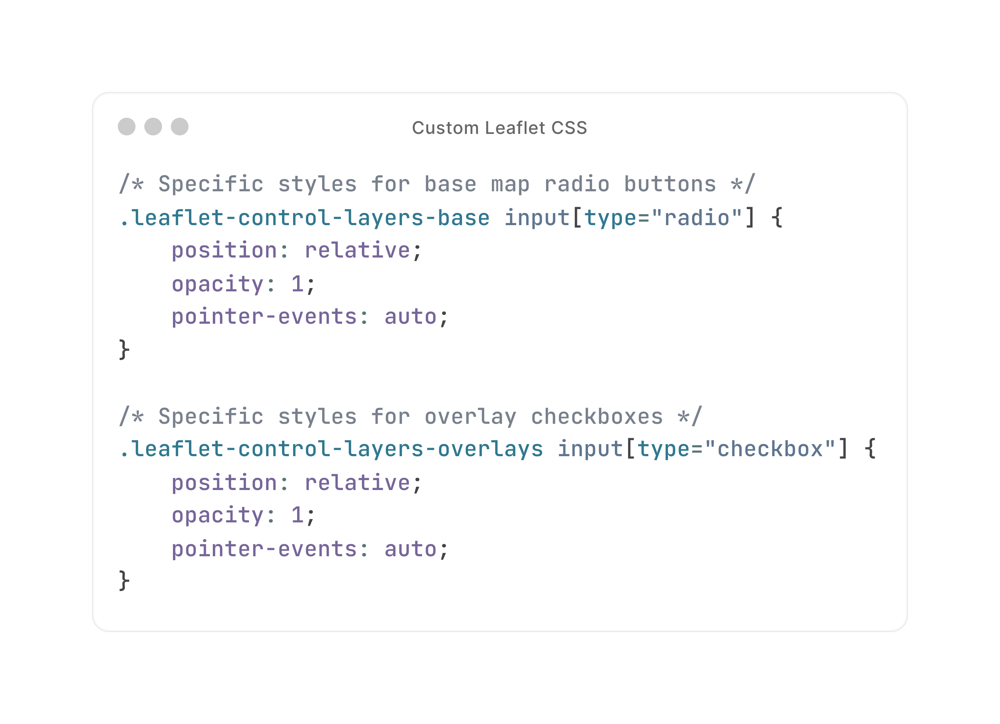
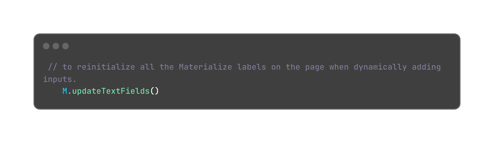
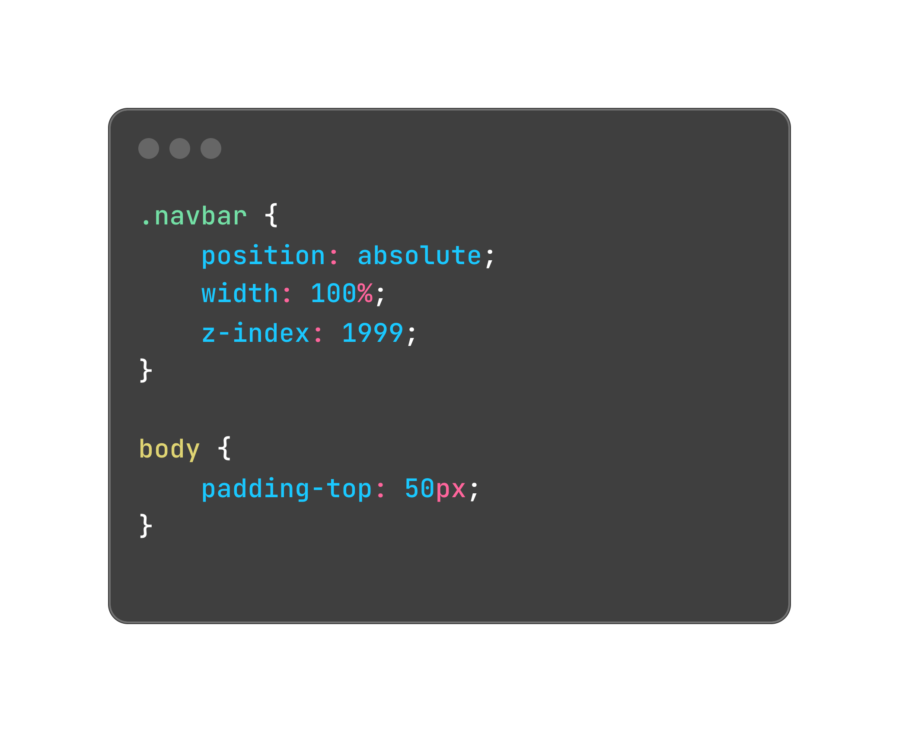

# LiDARFIND TESTING

## Overview
**LiDARFind** is a web application designed for enthusiasts and professionals to explore and discover archaeological sites in Wales using LiDAR data. The platform allows users to view, interact with, and edit LiDAR data on an interactive map interface.  The live website can be found here [LiDARFind: The Welsh LiDAR Portal](https://lidarfind-a137ffb9e451.herokuapp.com/)


 Back to [README.md](ReadME.md).

 # Contents

1. [LiDARFind Testing](#lidarfind-testing)
2. [Overview](#overview)
3. [Automated Testing](#automated-testing)
    - [HTML](#html)
    - [CSS Validation](#css-validation)
    - [JSHint](#jshint)
    - [Lighthouse Analysis](#lighthouse-analysis)
4. [Manual Testing](#manual-testing)
    - [Feature Testing](#feature-testing)
    - [Browser Compatibility](#browser-compatibility)
    - [Responsiveness Test](#responsiveness-test)
5. [Testing User Stories](#testing-user-stories)
    - [As a User](#1-as-a-user)
    - [As a Visitor Without an Account](#2-as-a-visitor-without-an-account)
    - [As a Registered User](#3-as-a-registered-user)
    - [As an Administrator of the Site](#4-as-an-administrator-of-the-site)
6. [Defensive Coding](#defensive-coding)
7. [Role-Based Access Control](#role-based-access-control)
8. [User Feedback](#user-feedback)
9. [Bugs](#bugs)
    - [Fixed Bugs](#fixed-bugs)
        - [Conflict Between Materialize and Leaflet Layer Controls](#conflict-between-materialize-and-leaflet-layer-controls)
        - [MongoDB '_id' Field Cannot be Directly Used in JSON](#mongodb-_id-field-cannot-be-directly-used-in-json)
        - [Data Fetching Issue with MongoDB Cursor](#data-fetching-issue-with-mongodb-cursor)
        - [Prefilling Input Texts](#prefilling-input-texts)
        - [Navbar Pushed Page Content Down on Smaller Screens](#navbar-pushed-page-content-down-on-smaller-screens)
        - [Referrer Parameter Not Carried Over in Form Submission](#referrer-parameter-not-carried-over-in-form-submission)
        - [Location Field Editable After Validation Causes Map Rendering Issues](#location-field-editable-after-validation-causes-map-rendering-issues)

 LiDARFind underwent comprehensive testing to ensure functionality, user engagement, and compatibility across various platforms. Both manual and automated testing methods were employed to scrutinise every aspect of the website and has been documented here.

 # AUTOMATED TESTING
 Automated testing was undertaken using a range of open-source developer tools including Google Lighthouse Analysis, HTML, CSS and JavaScript validation. These tests assessed the quiz's quality, performance, accessibility and adherence to web standards. Any identified issues were addressed to enhance the websites usability and overall user experience.

 ## HTML

 To test the markup validity [HTML Validator](https://validator.w3.org/) was used to assess markup validity and compliance with accessibility standards. THe following table shows the results for each page:

### HTML Validation Test Results

#### Summary Table

| Page             | Date     | Comments                                          | Pass/Fail |
|------------------|----------|--------------------------------------------------|-----------|
| Home             | 22/07/24 | No errors or warnings                            | Pass      |
| Resources        | 22/07/24 | No errors or warnings                            | Pass      |
| Log in           | 22/07/24 | No errors or warnings                            | Pass      |
| Register         | 22/07/24 | No errors or warnings                            | Pass      |
| Profile          | 22/07/24 | No errors or warnings                            | Pass      |
| Record           | 22/07/24 | No errors or warnings                            | Pass      |
| Edit record      | 23/07/24 | No errors or warnings                            | Pass      |
| Log out          | 23/07/24 | No errors or warnings                            | Pass      |
| Admin Dashboard  | 23/07/24 | Duplicate IDs are generated in the HTML for user and record elements* | Fail      |
| Admin Dashboard  | 23/07/24 | No errors or warnings                            | Pass      |

#### * Detailed Issue Report: Admin Dashboard

- **Date:** 23/07/24
- **Issue:** Duplicate IDs are being generated in the HTML for user and record elements.
- **Description:** 
  - When rendering the Admin Dashboard page, duplicate IDs were being generated due to the use of loop indices (`{{ loop.index }}`) for ID generation within nested loops. This caused validation errors and potential conflicts in element manipulation.
- **Solution:**
  - The HTML template was updated to use unique identifiers for user and record elements, specifically `{{ user._id }}` and `{{ record._id }}`, to ensure that each element has a unique ID.
- **Status:** Issue resolved, the Admin Dashboard now passes HTML validation with no errors or warnings.

## CSS Validation

The CSS code of the website was validated using the [W3C CSS Validator](https://jigsaw.w3.org/css-validator/#validate_by_input). The validation results are as follows:

### Noted Issue

1. **Error Detected**:
   - **Property**: `font-optical-sizing`
   - **Value**: `auto`
   - **Description**: The property `font-optical-sizing` doesn't exist in CSS.

### Action Taken

The property `font-optical-sizing: auto;` was removed from the CSS to resolve the validation error.

This ensures that the CSS code is fully compliant with web standards and free of validation errors.


## JSHint

### script.js Testing Report

| Metric                                      | Value                                    |
|---------------------------------------------|------------------------------------------|
| **Total number of functions**               | 18                                       |
| **Function with the largest signature**       | 1 argument                               |
| **Median number of arguments per function** | 0                                        |
| **Largest function (statements)**           | 7 statements                             |
| **Median number of statements per function**  | 2 statements                             |
| **Most complex function (cyclomatic)**      | Cyclomatic complexity value of 2          |
| **Median cyclomatic complexity**            | 1                                        |

**Unused Variables**

The following variables were initially flagged by JSHint as unused but are actually used in the HTML for functionality:
- `tooltipList`: Used for initialising Bootstrap tooltips.
- `openCreateForm`: Used to open the create record form.
- `closeCreateForm`: Used to close the create record form.
- `openFilter`: Used to open the filter section.
- `closeFilters`: Used to close the filter section.

These were fixed by adding the `/* exported ... */` directive at the top of the JavaScript file to inform JSHint that these variables are used externally.


### lidar-map.js Testing Report

| Metric                                      | Value                                    |
|---------------------------------------------|------------------------------------------|
| **Total number of functions**               | 12                                       |
| **Function with the largest signature**     | 2 argument                               |
| **Median number of arguments per function**    | 1                                        |
| **Largest function (statements)**           | 9 statements                             |
| **Median number of statements per function**  | 2.5 statements                           |
| **Most complex function (cyclomatic)**      | Cyclomatic complexity value of 7             |
| **Median cyclomatic complexity**            | 1                                        |

**Unused Variables**

The following variables were initially flagged by JSHint as unused but are actually used in the HTML for functionality:
- `openDeleteModal`: Used for opening the confirmation delete modal

These were fixed by adding the `/* exported ... */` directive at the top of the JavaScript file to inform JSHint that these variables are used externally.

**Undefined Variable**
- **One undefined variable**: `isAdmin` on line 89.

This warning occurs because the `isAdmin` variable is declared in the HTML template and not directly within the JavaScript file. 

To manage the isAdmin variable effectively and ensure it reflects the user's actual status, I am declaring it in the HTML using server-side templating. This approach allows the backend to pass the isAdmin status dynamically based on the authenticated user's role. Here’s the declaration in the HTML:

html
Copy code
`<script>
    var isAdmin = {{ is_admin|tojson }};
</script>`

By doing this, isAdmin is available globally in our JavaScript files without the need to redeclare it, ensuring it accurately represents the user's admin status. Despite JSHint flagging isAdmin as an undefined variable in the JavaScript files, the script works as expected because the variable is defined in the HTML before any JavaScript execution.

This method ensures the isAdmin variable is dynamic and secure, reflecting the actual status of the user logged in, and avoids hardcoding it to true or false within the JavaScript code. This approach maintains the integrity of our application by ensuring that only users with the correct admin privileges can access certain functionalities.

To suppress the JSHint warning,  /* global isAdmin */  is added to the directive at the top of the JavaScript file. 

This informs JSHint that isAdmin is a globally defined variable, resolving the warning while ensuring the code remains functional and clear.

### homepage-map.js Testing Report

| Metric                                      | Value                                    |
|---------------------------------------------|------------------------------------------|
| **Total number of functions**               | 11                                       |
| **Function with the largest signature**     | 1 argument                               |
| **Median number of arguments per function**    | 1                                        |
| **Largest function (statements)**           | 6 statements                             |
| **Median number of statements per function**  | 1 statements                           |
| **Most complex function (cyclomatic)**      | Cyclomatic complexity value of 7             |
| **Median cyclomatic complexity**            | 1                                        |


**Undefined Variable**
- **One undefined variable**: `L`

This warning occurs because the `L` variable, provided by the Leaflet library, is defined globally and not within the JavaScript file itself. 

To resolve this warning `/* global L*/` is added to the directive at the top of the JavaScript file. 
This directive informs JSHint that `L` and `bootstrap` are globally defined variables, preventing the tool from flagging them as undefined. 
This ensures that the code is correctly validated without unnecessary warnings, while maintaining the functionality provided by these libraries.

### edit-page.js Testing Report

| Metric                                      | Value                                    |
|---------------------------------------------|------------------------------------------|
| **Total number of functions**               | 2                                       |
| **Function with the largest signature**     | 1 argument                               |
| **Median number of arguments per function**    | 0.5                                        |
| **Largest function (statements)**           | 11 statements                             |
| **Median number of statements per function**  | 8 statements                           |
| **Most complex function (cyclomatic)**      | Cyclomatic complexity value of 2             |
| **Median cyclomatic complexity**            | 1.5                                        |

**Undefined Variable**
- **One undefined variable**: `L`

This warning occurs because the `L` variable, provided by the Leaflet library, is defined globally and not within the JavaScript file itself. 

To resolve this warning `/* global L*/` is added to the directive at the top of the JavaScript file. 
This directive informs JSHint that `L` and `bootstrap` are globally defined variables, preventing the tool from flagging them as undefined. 
This ensures that the code is correctly validated without unnecessary warnings, while maintaining the functionality provided by these libraries.

## Lighthouse Analysis
Lighthouse in Chrome Developer Tools was used to assess the performance, accessibility, best practice and SEO rating of the website. The analysis was conducted on both mobile and desktop devices, and the scores were recorded for each page of the website. The table below illusrates the results of the analysis. 

### With Map Elements

| Page             | Performance       |                | Accessibility     |                | Best Practice     |                | SEO            |                |
|------------------|-------------------|----------------|-------------------|----------------|-------------------|----------------|----------------|----------------|
|                  | Mobile (%)        | Desktop (%)    | Mobile (%)        | Desktop (%)    | Mobile (%)        | Desktop (%)    | Mobile (%)     | Desktop (%)    |
| Home             | 45                | 90             | !                 | !              | 100               | 100            | 100            | 100            |
| Resources        | 72                | 94             | 98                | 93             | 100               | 100            | 100            | 100            |
| Log in           | 84                | 97             | 96                | 96             | 100               | 100            | 100            | 100            |
| Register         | 73                | 98             | 96                | 96             | 100               | 100            | 100            | 100            |
| Profile          | 83                | 98             | 95                | 95             | 100               | 100            | 100            | 100            |
| Record           | 73                | 90             | !                 | !              | 96                | 96             | 100            | 100            |
| Edit record      | 73                | 95             | !                 | !              | 96                | 96             | 100            | 100            |
| Log out          | 83                | 98             | 95                | 95             | 100               | 100            | 100            | 100            |
| Admin Dashboard  | 81                | 96             | 100               | 100            | 100               | 100            | 100            | 100            |

From the table above it is evidence that pages containing maps displayed significantly lower performance and accesibility scores, particularly on mobile devices. It seems plausible to suggest that the presence of the leaflet maps was contributing to the reduced scores.

To test this hypothesis a comparative analysis was carried out, this time removing the map elements from the affected pages. The results are recorded in the table below:

### Without Map

| Page             | Performance       |                | Accessibility     |                | Best Practice     |                | SEO            |                |
|------------------|-------------------|----------------|-------------------|----------------|-------------------|----------------|----------------|----------------|
|                  | Mobile (%)        | Desktop (%)    | Mobile (%)        | Desktop (%)    | Mobile (%)        | Desktop (%)    | Mobile (%)     | Desktop (%)    |
| Home             | 60                | 93             | 95                | 95             | 100               | 96             | 100            | 100            |
| Record           | 88                | 97             | 95                | 95             | 96                | 96             | 100            | 100            |
| Edit record      | 83                | 99             | 95                | 96             | 96                | 100            | 100            | 100            |

The performance scores for mobile devices show a marked improvement when the leaflet map is removed from the pages. For example, the Home page perforamnce incrases from 45% to 60% on mobile.
The difference is less pronounced for desktop performancce scores, which are generally higher with or without the map. 
The accessibility scores are not consistently reported when the map elements were present. Once removed the scores are unoformly higher. 
The best practice and SEO scores are consistently high with and without map elements, indicting they are not affected by the leaflet map. 

By running the Lighthouse analysis twice - first with the maps included and then with the maps removed - it is possible to identify that the performance and accessibility are impacted by leaflet maps. This method provided a concrete basis for understanding how dynamic, interactive elements like maps can affect web page metrics, particularly on mobile devices. The inclusion of the Leaflet map appears to introduce performance bottlenecks, particularly affecting the mobile experience. This is likely due to the additional JavaScript and rendering required to display and interact with the map. By deferring the loading of non-essential scripts and styles or optimising the map integration, it might be possible to mitigate some of these performance impacts. However, the map provides significant functionality and value to the user experience, so these trade-offs need careful consideration.

In a final effort to increase performance and accessibility of the home page, particularly on mobile devices, "Lazy Loading" using intersection Observer was implemented to defer the loading of the map element on the home page until it enters viewport.

### With Lazy Loading using Intersection Observation

| Page             | Performance       |                | Accessibility     |                | Best Practice     |                | SEO            |                |
|------------------|-------------------|----------------|-------------------|----------------|-------------------|----------------|----------------|----------------|
|                  | Mobile (%)        | Desktop (%)    | Mobile (%)        | Desktop (%)    | Mobile (%)        | Desktop (%)    | Mobile (%)     | Desktop (%)    |
| Home             | 48                | 91             | 95                | 95             | 75               | 100            | 100            | 100            |


By implementing lazy loading for the map element using the intersection observer it was possible to mitigate some of the performance and accessibility impacts. This approach defers the loading time of the map until it enters the viewport, thus reducing the intial load time. 

In hindsight, I realise that including an interactive element such as a map on the home page may not have been the best decision. For a marketing website, this could potentially lead to a significant bounce rate as the performance and accessibility impacts might deter users from staying on the page.

However, given that this website is map-oriented and heavily relies on displaying geographical data, the inclusion of a map on the home page serves an essential purpose. It aligns with the primary functionality and user expectations of the site. Therefore, under these specific circumstances, the performance trade-offs are justified and likely not to cause significant issues.

Additionally, I tested other websites that rely heavily on maps, including Google Maps and Rightmove, and observed that they also have low scores for performance. This observation suggests that the inclusion of interactive maps inherently impacts performance metrics, yet these websites still provide significant value and usability despite the lower scores

### Other Notable Observations From Lighthouse Analysis
During the Lighthouse analysis of the Home Page, several warnings were flagged in the console, indicating "Third party cookie is blocked in Chrome as part of Privacy Sandbox." These warnings appear to be related to external libraries associated with wistia rather than being part of my own codebase. When running Lighthouse in incognito mode, these warnings were not flagged, suggesting that these third-party cookies are blocked due to Chrome's enhanced privacy settings in regular browsing mode. 
These warnings were not logged in the console when viewing the site using safari browser. 
These warnings do not direcly impact the core functionality of the website.

# MANUAL TESTING

## Feature Testing:

For each feature the expected outcomes and actual outcomes are clearly defined for each feature, making it easy to assess whether the application meets the requirements. This process makes it easier to identify and address any issues or discrepancies that may arise and also serves as a reference point for other developers to understand the expected behaviour of a feature. The results are recorded in the following tables:

<details>
  <summary>Common Features</summary>

  | Feature                | Expected Outcome                                                              | Testing Procedure                                                                 | Actual Outcome                                                                                   |
  |------------------------|-------------------------------------------------------------------------------|----------------------------------------------------------------------------------|--------------------------------------------------------------------------------------------------|
  | Favicon                | The favicon should be visible in the browser tab.                             | Checked the visibility of the favicon in various browsers.                        | The favicon appeared as expected, ensuring brand consistency and recognition in the browser tab. |
  | Responsive Design      | The website should be accessible and usable on any device (mobile, tablet, desktop). | Tested the website on various devices and screen sizes.                          | The website was responsive and usable on all tested devices.                                      |
  | Navigation             | Users should be able to navigate the website effortlessly.                    | Tested the navigation by clicking through all links and buttons.                  | Navigation was smooth and all links/buttons worked as expected.                                   |
  | Brand Logo             | Clicking the brand logo should take the user back to the home page.           | Clicked on the brand logo from various pages.                                      | Clicking the brand logo redirected to the home page as expected.                                  |
  | Social Media Links     | Social media links in the footer should open the respective platform in a new tab. | Clicked on the social media links in the footer.                                  | Social media links opened the respective platforms in a new tab as expected.                      |
</details>

<details>
  <summary>Home Page Features</summary>

| Feature                  | Expected                                          | Testing                                                              | Outcome                                                             |
|--------------------------|---------------------------------------------------|----------------------------------------------------------------------|---------------------------------------------------------------------|
| Hero Section             | Displays the title and tagline prominently.       | Verify the hero section's visibility and text content.               | Hero section is visible with correct title and tagline.             |
| Registration and Login   | Buttons for registration and login are functional.| Click on "Register" and "Log In" buttons to ensure they work.        | Buttons navigate to registration and login pages respectively.      |
| What is LiDAR Section    | Provides information about LiDAR technology.      | Read the content and check for correct information.                  | Information about LiDAR is correct and informative.                 |
| About Section            | Describes the purpose and functionality of LiDARFind.| Read the content and verify its relevance.                           | About section provides clear and relevant information.              |
| Getting Started Section  | Three cards for Register, Explore, and Record.    | Hover on each card and observe transition effect and verify the icons and text.                    | Each card displays correct icon and text, providing relevant info.  |
| Tutorial Video           | Embeds a tutorial video for user guidance.        | Play the video to ensure it loads and plays correctly.               | Tutorial video loads and plays without issues.                      |
| Interactive Map          | Displays the map with filtering options.          | Interact with the map, apply filters, and reset filters.             | Map displays correctly, filters work as expected.                   |
| Filter Popup             | Opens and closes the filter popup correctly.      | Click on the filter button and close button to verify functionality. | Filter popup opens and closes as expected.                          |
| Lazy Loading map      | map loads lazily to improve performance.        | Scroll through the page and observe map loading behavior.          | map loads as they come into the viewport, improving performance.  |
| Load indicator    | Display an unobtrusive loading indicator when tiles are loading                                          | Trigger map tile loading by navigating to different map areas or layers and observe the indicator      | The loading indicator is displayed correctly during tile loading and disappears once loading is complete |
</details>

<details>
  <summary>Resource Page Features</summary>

| Feature                     | Expected                                                           | Testing                                                                                              | Outcome                                                                         |
|-----------------------------|---------------------------------------------------------------------|------------------------------------------------------------------------------------------------------|---------------------------------------------------------------------------------|
| Resources Section           | Section displays a title and introductory text                     | Verify that the title "Resources" and introductory text are displayed                                | The title and introductory text are displayed correctly                        |
| Resource Links              | Each resource card contains an image, title, description, and link | Check that each resource card displays the correct image, title, description, and link               | Each resource card displays the correct information                            |
| Resource Link Navigation    | Links open in a new tab                                            | Click on each "Visit" button and ensure it opens the respective resource in a new tab                | Each resource link opens the correct resource in a new tab                     |                    |
| Card Hover Effect           | Cards have a hover effect that slightly elevates the card          | Hover over each card and check for the elevation effect                                               | The card elevation effect occurs as expected                                   |
</details>


<details>
  <summary>Log In Page Features</summary>


| Feature            | Expected                                                          | Testing                                                                 | Outcome                                                                 |
|--------------------|-------------------------------------------------------------------|------------------------------------------------------------------------|-------------------------------------------------------------------------|
| Flash Messages     | Display error messages if login fails                             | Attempt to log in with incorrect credentials and observe error messages | Error messages are displayed correctly, informing users of login issues |
| Log In Button      | Button should be visible and clickable                            | Check the visibility and functionality of the login button              | The login button is visible and functional, allowing users to attempt login |
| Username Field     | Accepts alphanumeric characters and special characters with validation | Enter various inputs to test validation rules                            | The username field accepts valid inputs and shows validation errors for invalid ones |
| Password Field     | Accepts alphanumeric characters and special characters with validation | Enter various inputs to test validation rules                            | The password field accepts valid inputs and shows validation errors for invalid ones |
| Register Prompt    | Link should navigate to the registration page                     | Click the "Need to Register?" link and observe the navigation           | Clicking the link navigates to the registration page, facilitating new user registration |
</details>

<details>
  <summary>Registration Page Features</summary>
| Feature               | Expected                                                                 | Testing                                                             | Outcome                                                                 |
|-----------------------|--------------------------------------------------------------------------|---------------------------------------------------------------------|-------------------------------------------------------------------------|
| Flash Messages        | Display error messages if registration fails                             | Attempt to register with invalid inputs and observe error messages  | Error messages are displayed correctly, informing users of registration issues |
| Register Button       | Button should be visible and clickable                                   | Check the visibility and functionality of the register button       | The register button is visible and functional, allowing users to attempt registration |
| Username Field        | Accepts alphanumeric characters and shows validation for invalid inputs  | Enter various inputs to test validation rules                       | The username field accepts valid inputs and shows validation errors for invalid ones |
| Password Field        | Accepts alphanumeric and special characters with validation              | Enter various inputs to test validation rules                       | The password field accepts valid inputs and shows validation errors for invalid ones |
| Confirm Password Field| Matches the password field and shows validation if passwords do not match| Enter different passwords in the password and confirm password fields | Validation error is displayed if passwords do not match |
| Skill Level Dropdown  | Accepts selection from predefined skill levels                           | Select various skill levels to ensure dropdown functionality        | The skill level dropdown accepts and shows the selected skill levels correctly |
| Log In Prompt         | Link should navigate to the login page                                   | Click the "Already Registered? Log in here." link and observe the navigation | Clicking the link navigates to the login page, facilitating user login |
</details>

<details>
  <summary>Profile Page Features</summary>

| Feature              | Expected                                                               | Testing                                                             | Outcome                                                                 |
|----------------------|------------------------------------------------------------------------|---------------------------------------------------------------------|-------------------------------------------------------------------------|
| Flash Messages       | Display success messages for user actions                              | Perform actions that trigger flash messages and observe their display | Success messages are displayed correctly, informing users of the action results (succesful login, edit & delete record) |
| Profile Details      | Display user profile details including username, member since, and total records | View the profile page and verify the display of user details        | User details are displayed correctly, showing accurate profile information |
| Edit Record Button   | Button should be visible and clickable                                 | Check the visibility and functionality of the edit record button    | The edit record button is visible and functional, allowing users to edit their records |
| Delete Record Button | Button should be visible and clickable                                 | Check the visibility and functionality of the delete record button  | The delete record button is visible and functional, allowing users to delete their records |
| Delete Confirmation  | Display confirmation modal before deleting a record                    | Attempt to delete a record and observe the confirmation modal       | The confirmation modal is displayed correctly, asking users to confirm the deletion |
| Accordion for Records| Expand and collapse individual records                                 | Click on each record's header to expand and collapse the details    | The accordion expands and collapses correctly, showing and hiding record details |
| Create a Record Button | Button should be visible and clickable                               | Check the visibility and functionality of the create a record button | The create a record button is visible and functional, allowing users to create new records |
</details>


<details>
  <summary>Record Page Features</summary>

| Feature                | Expected                                                                                     | Testing                                                             | Outcome                                                                 |
|------------------------|----------------------------------------------------------------------------------------------|---------------------------------------------------------------------|-------------------------------------------------------------------------|
| Flash Messages         | Display success messages for actions such as record create, edit & delete                                 | Perform actions that trigger flash messages and observe their display | Success messages are displayed correctly, informing users of the action results |
| Map Display            | Display a map centred on a specific location with layers and markers                         | View the map and verify the correct display of layers and markers   | The map is displayed correctly with the specified layers and markers    |
| Create Record Button   | Button should be visible and clickable                                                       | Check the visibility and functionality of the create record button  | The create record button is visible and functional, allowing users to create new records |
| Filter Button          | Button should be visible and clickable                                                       | Check the visibility and functionality of the filter button         | The filter button is visible and functional, allowing users to apply filters on records |
| Create Record Form     | Form should be visible and functional when create button is clicked                          | Click the create record button and verify the form display and functionality | The form is displayed correctly and functional, allowing users to enter and save new records |
| Filter Form            | Form should be visible and functional when filter button is clicked                          | Click the filter button and verify the form display and functionality | The form is displayed correctly and functional, allowing users to apply filters |
| Title Field            | Accepts a valid title input with validation                                                  | Enter various inputs to test validation rules                       | The title field accepts valid inputs and shows validation errors for invalid ones |
| PRN Field              | Accepts a valid PRN input with validation                                                    | Enter various inputs to test validation rules                       | The PRN field accepts valid inputs and shows validation errors for invalid ones |
| Site Type Dropdown     | Accepts selection from predefined site types                                                 | Select various site types to ensure dropdown functionality          | The site type dropdown accepts and shows the selected site types correctly |
| Monument Type Dropdown | Accepts selection from predefined monument types                                             | Select various monument types to ensure dropdown functionality      | The monument type dropdown accepts and shows the selected monument types correctly |
| Description Field      | Accepts a valid description input with validation                                            | Enter various inputs to test validation rules                       | The description field accepts valid inputs and shows validation errors for invalid ones |
| Period Dropdown        | Accepts selection from predefined historical periods                                         | Select various periods to ensure dropdown functionality             | The period dropdown accepts and shows the selected periods correctly    |
| Location Field         | Accepts a valid location input with validation when map is clicked                           | Click on the map to enter a location and verify the input validation | The location field accepts valid inputs from the map click and shows validation errors for invalid ones |
| Reset Filters Button   | Resets all filter inputs to default values                                                   | Apply filters and click reset to verify functionality               | The reset filters button resets all filters to their default values and shows all records |
| Delete Confirmation    | Display confirmation modal before deleting a record                                          | Attempt to delete a record and observe the confirmation modal       | The confirmation modal is displayed correctly, asking users to confirm the deletion |
| Load indicator    | Display an unobtrusive loading indicator when tiles are loading                                          | Trigger map tile loading by navigating to different map areas or layers and observe the indicator      | The loading indicator is displayed correctly during tile loading and disappears once loading is complete |
</details>


<details>
  <summary>Edit Record Page Features</summary>

| Feature                | Expected                                                                                     | Testing                                                             | Outcome                                                                 |
|------------------------|----------------------------------------------------------------------------------------------|---------------------------------------------------------------------|-------------------------------------------------------------------------|
| Flash Messages         | After editing a record user is returned to the referring page and a success flash message is displayed                                  | Edit a record from the profile and record page to check user is returned to same page and flash message is displayed |Users are returned to the referring page and a success message is displayed |
| Map Display            | Display a map centred on the current record location with layers and markers                 | View the map and verify the correct display of layers and markers   | The map is displayed correctly with the specified layers and markers    |
| Edit Record Form       | Form should be visible and functional                                                        | View the form and verify its functionality                          | The form is displayed correctly and functional, allowing users to edit the record |
| Title Field            | Displays current title and accepts valid title input with validation                         | View the title field and enter various inputs to test validation rules | The title field displays the current title, accepts valid inputs, and shows validation errors for invalid ones |
| PRN Field              | Displays current PRN and accepts valid PRN input with validation                             | View the PRN field and enter various inputs to test validation rules | The PRN field displays the current PRN, accepts valid inputs, and shows validation errors for invalid ones |
| Site Type Dropdown     | Displays current site type and accepts selection from predefined site types                  | View the site type dropdown and select various site types           | The site type dropdown displays the current site type and shows the selected site types correctly |
| Monument Type Dropdown | Displays current monument type and accepts selection from predefined monument types          | View the monument type dropdown and select various monument types   | The monument type dropdown displays the current monument type and shows the selected monument types correctly |
| Description Field      | Displays current description and accepts valid description input with validation             | View the description field and enter various inputs to test validation rules | The description field displays the current description, accepts valid inputs, and shows validation errors for invalid ones |
| Period Dropdown        | Displays current period and accepts selection from predefined historical periods             | View the period dropdown and select various periods                 | The period dropdown displays the current period and shows the selected periods correctly |
| Location Field         | Displays current location and updates when map is clicked                                    | View the location field and click on the map to update the location | The location field displays the current location and updates correctly when the map is clicked |
| Cancel Button          | Navigates back to the previous page without saving changes                                   | Click the cancel button and verify the navigation                   | The cancel button navigates back to the previous page without saving any changes |
| Save Changes Button    | Saves the changes made to the record and displays success message                            | Click the save changes button and verify the functionality          | The save changes button saves the changes made to the record and displays a success message |
| Load indicator    | Display an unobtrusive loading indicator when tiles are loading                                          | Trigger map tile loading by navigating to different map areas or layers and observe the indicator      | The loading indicator is displayed correctly during tile loading and disappears once loading is complete |
</details>

<details>
  <summary>Log Out Page Features</summary>

| Feature             | Expected                                                                 | Testing                                             | Outcome                                                                |
|---------------------|--------------------------------------------------------------------------|-----------------------------------------------------|------------------------------------------------------------------------|
| Logout Confirmation | Display a message confirming successful logout                           | Log out and observe the confirmation message        | Confirmation message is displayed correctly, informing users of successful logout |
| Log In Button       | Button should be visible and clickable                                   | Check the visibility and functionality of the log in button | The log in button is visible and functional, allowing users to navigate to the login page |
| Return to Home Button | Button should be visible and clickable                                 | Check the visibility and functionality of the return to home button | The return to home button is visible and functional, allowing users to navigate to the home page |
</details>

<details>
  <summary>Admin Dashboard Features</summary>

| Feature                | Expected                                                                                     | Testing                                                             | Outcome                                                                 |
|------------------------|----------------------------------------------------------------------------------------------|---------------------------------------------------------------------|-------------------------------------------------------------------------|
| Flash Messages         | Display success messages for admin actions such as deleting users and editing and deleting records                                                  | Perform actions that trigger flash messages and observe their display | Success messages are displayed correctly, informing users of the action results |
| Admin Dashboard Header | Display the admin dashboard header correctly                                                 | View the header and verify the display                              | The admin dashboard header is displayed correctly                       |
| User Accordion         | Display a list of all users with collapsible details                                         | View the user list and expand/collapse user details                 | The user list is displayed correctly, with details expanding and collapsing as expected |
| User Details           | Display user details including username, skill level, member since, and admin status         | View user details and verify accuracy                               | User details are displayed correctly and accurately                      |
| Delete User Button     | Button should be visible and clickable                                                       | Check the visibility and functionality of the delete user button    | The delete user button is visible and functional, allowing admins to delete users |
| Confirm Delete User Modal | Display confirmation modal before deleting a user                                         | Attempt to delete a user and observe the confirmation modal         | The confirmation modal is displayed correctly, asking admins to confirm the deletion |
| User Records Accordion | Display a list of all records created by a user with collapsible details                     | View the records list and expand/collapse record details            | The records list is displayed correctly, with details expanding and collapsing as expected |
| Record Details         | Display record details including title, site type, monument type, description, period, location, and created on | View record details and verify accuracy                             | Record details are displayed correctly and accurately                    |
| Edit Record Button     | Button should be visible and clickable                                                       | Check the visibility and functionality of the edit record button    | The edit record button is visible and functional, allowing admins to edit records |
| Delete Record Button   | Button should be visible and clickable                                                       | Check the visibility and functionality of the delete record button  | The delete record button is visible and functional, allowing admins to delete records |
| Confirm Delete Record Modal | Display confirmation modal before deleting a record                                     | Attempt to delete a record and observe the confirmation modal       | The confirmation modal is displayed correctly, asking admins to confirm the deletion |
</details>

<details>
  <summary>404 Error Page Features</summary>

| Feature             | Expected                                                                | Testing                                                             | Outcome                                                                 |
|---------------------|-------------------------------------------------------------------------|---------------------------------------------------------------------|-------------------------------------------------------------------------|
| Error Message       | Display a 404 error message                                             | Navigate to a non-existent page and observe the error message       | Error message "404 Error" is displayed correctly, indicating the page is not found |
| Sorry Message       | Display a message informing the user that the page was not found         | View the message and verify the content                              | Message "Sorry.... We couldn't find the page you're looking for. It might have been moved or removed." is displayed correctly |
| Home Page Link      | Link should navigate to the home page                                   | Click the "Click Here" link and observe the navigation              | Clicking the link navigates to the home page                            |
| Register Link       | Link should navigate to the registration page                           | Click the "Need to Register?" link and observe the navigation       | Clicking the link navigates to the registration page                    |
</details>


<details>
  <summary>403 Error Page Features</summary>

| Feature             | Expected                                                                | Testing                                                             | Outcome                                                                 |
|---------------------|-------------------------------------------------------------------------|---------------------------------------------------------------------|-------------------------------------------------------------------------|
| Error Message       | Display a 403 error message                                             | Attempt to access a restricted page and observe the error message   | Error message "403 Error" is displayed correctly, indicating the user does not have permission to view the page |
| Sorry Message       | Display a message informing the user that they do not have permission    | View the message and verify the content                              | Message "Sorry.... You do not have permission to view this page." is displayed correctly |
| Home Page Link      | Link should navigate to the home page                                   | Click the "Click Here" link and observe the navigation              | Clicking the link navigates to the home page                            |
| Register Link       | Link should navigate to the registration page                           | Click the "Need to Register?" link and observe the navigation       | Clicking the link navigates to the registration page                    |
</details>

<details>
  <summary>Back Button Navigation</summary>
| Feature                       | Expected                                              | Testing                                                                | Outcome                                                                        |
|-------------------------------|-------------------------------------------------------|------------------------------------------------------------------------|--------------------------------------------------------------------------------|
| Prevent Back to Login         | Prevent user from navigating back to the login page once logged in | Log in and use the browser's back button to attempt to return to the login page | User is redirected to the profile page, preventing access to the login page    |
| Prevent Back to Cached Profile| Prevent access to cached profile page after logging out | Log out and use the browser's back button to attempt to return to the profile page | User is redirected to the login page, preventing access to the cached profile page |


</details>

## Browser Compatibility:
- Expected: Consistent appearance and functionality across major browsers.
- Testing: Test site on Chrome, Mozilla, Safari, and Edge browsers.
- Outcome: The site renders as expected with good responsiveness and compatibility across different browsers.

## Responsiveness Test:
Expected: Site should render appropriately on various devices with different screen sizes. Testing: Test responsiveness on iPhone 12, iPad 12, and desktop (1024px). Outcome: The site displays responsively across different devices, maintaining functionality and appearance as intended.


## Testing User Stories

#### 1. As a User

| User Story | Test Scenario | Test Steps | Result |
|------------|---------------|------------|--------|
| 1.1: Grasp essence of LiDARFind | Verify homepage content | 1. Open homepage<br>2. Check for clear explanation<br>3. Ensure benefits are highlighted | PASS |
| 1.2: Navigate website effortlessly | Verify navigation | 1. Open homepage<br>2. Navigate through pages<br>3. Ensure links and menus work | PASS |
| 1.3: Accessible on any device | Verify responsiveness | 1. Open on various devices<br>2. Resize browser<br>3. Ensure layout adjusts | PASS |

#### 2. As a Visitor Without an Account

| User Story | Test Scenario | Test Steps | Result |
|------------|---------------|------------|--------|
| 2.1: Understand website purpose | Verify homepage introduction | 1. Open homepage<br>2. Check for introductory message | PASS |
| 2.2: Browse discoveries | Verify browsing without login | 1. Navigate to map on home page page<br>2. Interact with map<br>3. Ensure entries viewable | PASS |
| 2.3: Search discoveries | Verify search/filter functions | 1. Go to map on home page<br>2. Use search/filter<br>3. Check results | PASS |
| 2.4: Register for an account | Verify registration | 1. Open Registration page<br>2. complete form<br>3. Ensure account creation | PASS |

#### 3. As a Registered User

| User Story | Test Scenario | Test Steps | Result |
|------------|---------------|------------|--------|
| 3.1: Secure login | Verify secure login | 1. Open Login page<br>2. Enter credentials<br>3. Ensure successful login | PASS |
| 3.2: Submit discoveries | Verify submission | 1. Log in<br>2. Go to create record<br>3. Fill details and submit | PASS |
| 3.3: Edit/delete discoveries | Verify editing/deleting | 1. Log in<br>2. Go to profile or record<br>3. Edit and save<br>4. Delete and confirm | PASS |
| 3.4: Easy logout | Verify logout | 1. Log in<br>2. Click "Logout"<br>3. Ensure redirection | PASS |

#### 4. As an Administrator of the Site

| User Story | Test Scenario | Test Steps | Result |
|------------|---------------|------------|--------|
| 4.1: Manage discoveries | Verify management | 1. Log in as admin<br>2. Go to admin dashboard<br>3. Add/edit/delete discoveries and users ensuring they are removed from the database | PASS |

## Defensive Coding

The following safeguards are used to ensure the reliability and security of the website. These measures handle unexpected inputs or actions, prevent potential vulnerabilities, and ensure the website behaves correctly even under adverse conditions.

| Route             | Defensive Coding Practice                           | Purpose                                        | Example                                                                                                            |
|-------------------|-----------------------------------------------------|------------------------------------------------|--------------------------------------------------------------------------------------------------------------------|
| Register          | Check if username already exists                    | Prevent duplicate usernames in the database    | ```python existing_user = mongo.db.users.find_one({"username": request.form.get("username").lower()}) if existing_user: flash("Username already exists") return redirect(url_for("register"))``` |
|                   | Hash and store passwords                            | Secure user passwords                          | ```python hashed_password = generate_password_hash(request.form.get("password"))```                                 |
|                   | Validate matching passwords                         | Ensure users confirm their password accurately | ```python if password != confirm_password: flash("Passwords must match", "danger") return redirect(url_for("register"))```                              |
| Login             | Validate user existence                             | Ensure only registered users can log in        | ```existing_user = mongo.db.users.find_one({"username": request.form.get("username").lower()})``` |
|                   | Store user in session                               | Maintain user session for authentication       | ```python session["user"] = user["username"]```                                                                   |
| Profile           | Validate user existence                             | Ensure the user exists before accessing profile| ```python user = mongo.db.users.find_one({"username": username}) if not user: abort(404) # User not found``` |
|                   | Check user session                                  | Ensure only logged-in users can access profiles| ```python if "user" not in session: flash("You must be logged in to view that page", "warning") return redirect(url_for("login"))``` |
|                   | Validate profile ownership                          | Ensure users can only view their own profiles  | ```python if username != session["user"]: abort(403) # Forbidden access``` |
| Logout            | Remove user from session                            | Securely log out user and remove session data  | ```python session.pop("user", None) session.pop("is_admin", None)```                                               |
| Admin Dashboard   | Validate admin privileges                           | Ensure only admins can access admin dashboard  | ```if not session.get("is_admin"): abort(403)   # Forbidden access``` |
| Edit Record       | Check user session                                  | Ensure only logged-in users can edit records   | `python if "user" not in session: flash("You must be logged in to view that page", "warning") return redirect(url_for("login"))` |
|                   | Validate record existence                           | Ensure the record exists before editing        | ```python if not record: abort(404)``` |
|                   | Validate record ownership or admin privileges       | Ensure only the record owner or an admin can edit the record | ```if record["created_by"] != session["user"] and not session.get("is_admin", False): abort(403)``` |
| Delete Record     | Check user session                                  | Ensure only logged-in users can delete records | ```if "user" not in session: abort(403)``` |
|                   | Validate record existence                           | Ensure the record exists before deleting       | ```record = mongo.db.records.find_one({"_id": ObjectId(record_id)}) if not record: abort(404)``` |
|                   | Validate record ownership or admin privileges       | Ensure only the record owner or an admin can delete the record | ```if record["created_by"] != session["user"] and not session.get("is_admin", False): abort(403)``` |
| Delete User       | Check user session                                  | Ensure only logged-in users with admin privilege can delete user accounts | ```if not session.get("is_admin"): abort(403)``` |
|                   | Validate user existence                             | Ensure the user exists before deleting         | ```user = mongo.db.users.find_one({"_id": ObjectId(user_id)}) if not user: abort(404)``` |
| General       | Prevent back button navigation to login and cached profile                                 | Ensure correct session handling and page navigation | ```def add_header(response): response.cache_control.no_store = True return response``` |

## Role-Based Access Control
LiDARFind employs Role-Based Access Control (RBAC) to manage user permissions effectively. There are two types of users on the website: standard users and admins. RBAC ensures that only admins have access to restricted pages and functionalities. During the registration process, a hidden boolean field `is_admin` is set to `false` by default, designating the new user as a standard user. This field can be manually updated to `true` to grant administrative privileges to the user.

To confirm that each user type had the appropriate level of access, various scenarios were tested for both standard users and admins. The following table documents the test cases and results:


| Test Case | Objective | Process | Outcome |
|------------|---------------|------------|--------|
| Administrator Access     | Confirm that administrators have unrestricted access to all sections of the site.    | 1. Log in as an Administrator.<br>2. Navigate through all sections of the website, including the admin dashboard.<br>3. Verify the ability to access and perform administrative tasks such as editing/deleting records of any user and deleting users.   | Administrators had full access to all sections and functionalities, performing administrative tasks without any restrictions. |
| Standard User Access     | Ensure that standard users are limited to accessing only their own profile and are restricted from administrative areas. | 1. Log in as a Standard User.<br>2. Access the user’s profile.<br>3. Attempt to navigate to the admin dashboard.                                                                                                             | Standard users were correctly restricted to their own profiles and were denied access to the admin dashboard.        |
| URL Manipulation Checks  | Detect unauthorised access attempts through direct URL manipulation.                 | 1. Log in as one user type and note accessible URLs.<br>2. Log out and switch to a different user role.<br>3. Attempt to access the noted URLs directly by typing them into the browser.                                    | Unauthorised access attempts were effectively blocked, ensuring that users could not bypass role restrictions through URL manipulation. |
| Admin Role Protection    | Ensure that the 'Administrator' role cannot be selected or assigned during the user registration process. | 1. Navigate to the registration page.<br>2. Verify that the 'Administrator' role is not available for selection.<br>3. Attempt to manually set the role to 'Administrator' using form manipulation techniques. | The 'Administrator' role was not available for assignment during registration, ensuring that only designated users could become admins. |


### Conclusion

These tests confirm that our RBAC implementation is effective in restricting access based on user roles, thereby maintaining the security and integrity of the website. Each role functions as intended, with administrators having full access and standard users being appropriately limited.

# USER FEEDBACK
User feedback was sought to help enhance the website and tailor it to meet user needs. Below is a summary of the feedback received from user testing:

## Navigation and Usability

**Navigation:** Most users found the navigation intuitive, though some suggested that the website's target audience should be clarified (novices vs. knowledgeable users).

**Registration:** The registration process was straightforward and easy to complete.

**Creating, Editing, and Deleting Records:** Users were able to create, edit, and delete records without any issues.

**General Appearance:** The website was described as professional, uncluttered, and visually appealing, with a user-friendly profile section for managing records.

## Features and Functionality

**Liked Features:** Users appreciated the ease of accessing the entire LiDAR coverage of Wales and the professional look of the website.

**Disliked Features:** Some users noted that when a record is made, the map zooms out and the LiDAR layer turns off, which can be inconvenient if searching in a specific area.

## Suggestions for Improvement

**Additional Features:** Suggestions included more LiDAR data layers at higher resolutions and features to manipulate LiDAR data, such as 3D visualisation.

**Tooltips:** Users found the tooltips clear and informative but suggested adding a description for PRN to improve clarity for all users.

## Responsiveness and Bugs

**Device Responsiveness:** The website performed well across different devices (desktop, tablet, mobile) with no reported issues.

**Bugs and Errors:** No significant bugs or errors were encountered during testing.

**Map View Switching:** Users were able to switch between different map views successfully.

## Educational Resources

**Video Tutorial:** The video tutorial on the home page was helpful in understanding how to use the website, with positive feedback on its quality.

## Recommendations

**Likelihood to Recommend:** Users indicated they are likely to recommend the website to others interested in LiDAR data, particularly for professional projects and citizen science initiatives.

## Changes Made Based on Feedback

**Navigation Improvement:** Set the layers list on the map to always be expanded for users not familiar with interactive maps.

**Tooltip Enhancement:** Added a description of PRN to the tooltip for clarity.

## Future Development Considerations

**Map Zoom Issue:** Investigating a solution to maintain the current zoom level and layer settings after making a record to enhance user experience.


# BUGS
## Fixed Bugs

### Conflict Between Materialize and Leaflet Layer Controls

**Issue:** When integrating the Materialize CSS framework and Leaflet for interactive maps into the application, radio buttons for toggling base layers in the Leaflet layer control were not visible. This made it impossible for users to switch between different base map layers.

**Solution:** The root cause was identified as a CSS conflict between Materialize and Leaflet frameworks, where Materialize's default styles were interfering with Leaflet controls. Using Dev Inspector Tools, the class selector for the layer controls was identified. Custom CSS was then implemented to properly display radio buttons. Materialize CSS sets the opacity of radio buttons to "0", so this was changed to "1" to ensure the Leaflet layer controls displayed correctly.



**Outcome:** After applying these CSS rules, the radio buttons for base layers and checkboxes for overlay layers in the Leaflet layer control were displayed correctly and were fully functional. This solution ensured that users could interact with the map layers as intended, providing a consistent and intuitive user experience.

### MongoDB '_id' Field Cannot be Directly Used in JSON

**Issue:** When retrieving data from a MongoDB database and attempting to return it as a JSON response, an error occurred due to the presence of the _id field. The _id field in MongoDB is an ObjectId type, which cannot be directly represented in JSON.

**Solution:** To resolve the issue, the '_id' field needs to be either excluded from the retrieved data or converted to a string representation before returning it as a JSON response.

**Outcome:** By excluding the _id field the application can successfully return the retrieved data as a JSON response without encountering errors related to the ObjectId type used by MongoDB for the _id field.

### Data Fetching Issue with MongoDB Cursor

**Issue** When fetching data from MongoDB and using it multiple times within the same template, the data did not render correctly. This issue arose because the data was retrieved as a cursor, which can only be iterated over once. After the first use, the cursor was exhausted, making the data unavailable for subsequent uses within the template. This problem particularly impacted the rendering of dropdown options on the record page, where the same data was needed for both the "Create Record" form and the search filters. As a result, the data was only available for the first use, and subsequent attempts to access it resulted in no data being rendered.

**Solution** Convert the cursor to a list immediately after fetching the data. This ensures that the data is fully retrieved and can be used multiple times within the template.


**Outcome** The data can now be used in more than one dropdown, resolving the issue and ensuring consistent data rendering across the template.

### Prefilling Input Texts

**Issue** When dynamically entering adding coordinate data to the record form the placeholder labels were overlapping the prefilled text. 

**Solution** Call the function M.updateTextFields(); to reinitialize all the Materialize the labels on the page (source: Materailize).



**Outcome** When the input field is auto-populated with the coordinates the placeholder text moves in to the active state and no longer overlaps the input. 

### Navbar Pushed Page Content Down on Smaller Screens

**Issue** When the navbar is expanded on smaller screens, it pushes the page content down instead of overlaying it. This causes the layout to shift unexpectedly, affecting the user experience.

**Solution** To resolve the issue, the CSS for the navbar was updated to use position: absolute, ensuring the navbar overlays the page content instead of pushing it down. Additionally, padding was added to the body to prevent content from being hidden behind the navbar. The following CSS was added:



**Outcome**  By applying the position: absolute property to the navbar and adding padding-top to the body, the navbar now overlays the page content when expanded on smaller screens. This prevents the content from being pushed down and ensures it is not hidden behind the navbar, maintaining a consistent layout and improving the overall user experience.

### Referrer Parameter Not Carried Over in Form Submission

**Issue:** When editing a record, the referrer parameter (`ref`) was not being carried over during the form submission, causing the application to redirect to the wrong page after saving or canceling the edit. The `ref` parameter, included in the query string, was not available in the POST request.

**Solution:** To resolve this issue, the `ref` parameter needs to be included as a hidden input field within the form. This ensures that the `ref` value is part of the form data sent during the POST request. The `edit_record` route was updated to retrieve the `ref` value from the form data instead of the query string.

**Outcome:** By adding the `ref` parameter as a hidden input field in the form and retrieving it from the form data in the `edit_record` route, the application can correctly determine the referrer and redirect users to the appropriate page (profile or add_record) after editing a record. This ensures that users are redirected back to the page they originated from, improving the user experience.

### Location Field Editable After Validation Causes Map Rendering Issues

**Issue:** When creating a new record, the location field is required as it is essential for creating a marker. However, after the form is validated, users were able to edit the location field, including removing it completely, and then submit the form. This causes the record to lack a marker due to missing location information, and subsequent records, even with valid locations, did not display on the map. Deleting the record with the missing location information from the database restored the map rendering for subsequent records.

**Solution:** To resolve the issue, JavaScript was used to make the location field 'read-only' after the location information had been entered. This prevents users from removing the location after form validation.

**Outcome:** By making the location field read-only after entry, users can no longer remove essential location information post-validation, ensuring that all records display their markers correctly on the map and maintaining the integrity of the map rendering process.

### Browser Back Button Cache Issue

**Issue:** Issue: If a user logs in and then uses the back button of the browser, they are returned to the login page. If they try to log in as someone else at this point, it will fail, and they will continue to the profile page of the first login. Additionally, if a user logs out and then uses the back button on the browser, they are taken to a cached version of their profile. It may appear as if the user is logged in, but functionality such as edit and delete is not available.

**Solution:** To prevent users from navigating back to the login page once logged in using the URL, the following line of code was added:

`if "user" in session:
    return redirect(url_for("profile", username=session["user"]))`

To prevent users from using the back button to return to the login page or a cached profile after logging out, the following code was added:

`def add_header(response):
    response.cache_control.no_store = True
    return response
`

This function ensures that the browser does not store cache for the logged-out state, preventing the display of a cached profile page.

**Outcome:** After implementing these changes, users are redirected correctly based on their session status. If a user attempts to navigate back to the login page after logging in, they are redirected to their profile page. Additionally, after logging out, users cannot use the back button to access a cached version of their profile, ensuring that the application behaves securely and as expected.

[](https://fast.wistia.net/embed/iframe/lyr8u51gs1)

Click the image above to watch a demonstration.

